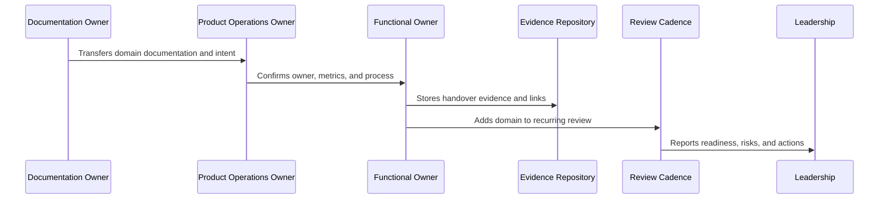
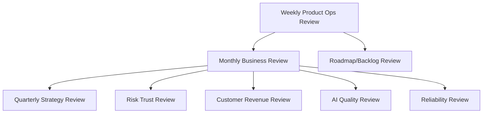

# Business Cadence Handover

> *"Defines handover for weekly product ops review, monthly business review, quarterly strategy, KPI/OKR model, risk/trust review, customer/revenue review, action tracking, and leadership reporting."*

---

# Purpose

Defines handover for weekly product ops review, monthly business review, quarterly strategy, KPI/OKR model, risk/trust review, customer/revenue review, action tracking, and leadership reporting.

---

# Handover Problem

Operating cadence becomes theater when meetings are scheduled but decisions, actions, and follow-up are not tracked.

---

# Handover Decision

## Decision

CLARA business cadence handover should turn Book IX into recurring reviews, decision logs, owned action items, and leadership visibility.

## Status

Accepted.

---

# Product Operations Handover Rule

Every CLARA product operations handover should connect:

```text
Domain -> Owner -> Cadence -> Metrics -> Evidence -> Escalation -> Roadmap Link -> Review Date
```

A handover is not mature if it cannot answer:

```text
who owns the domain
what process/cadence runs it
what metrics prove health
where evidence is stored
what escalation path exists
what roadmap/backlog link exists
what decisions are pending
what review date keeps it alive
```

---

# Recommended Handover Flow



---

# Production-Ready Checklist

- [ ] Owner is assigned.
- [ ] Cadence is defined.
- [ ] Metrics are defined.
- [ ] Evidence location is defined.
- [ ] Escalation path is defined.
- [ ] Related docs are linked.
- [ ] Open risks are listed.
- [ ] Action items are tracked.
- [ ] Review date is scheduled.
- [ ] AI coding assistant routing is clear.

---

# Acceptance Criteria

- [ ] Handover can be executed by a new team member.
- [ ] Product operations can continue after launch.
- [ ] Customer, support, growth, analytics, trust, reliability, AI, and cadence owners are visible.
- [ ] Book IX can be navigated from a master index.
- [ ] Decisions and evidence remain traceable.
- [ ] AI coding assistants can apply this safely.

---

# Anti-patterns

Avoid:

- Handover only as a meeting.
- No named owner.
- Metrics without review cadence.
- Cadence without decisions.
- Evidence scattered across chat.
- Roadmap items with no feedback link.
- Security/reliability/AI operations left outside product ops.
- Master index not created after final part.
- Documentation completed but not adopted.

---

# Related Documents

- ../PART-01-Product-Operations-Foundation/README.md
- ../PART-02-Customer-Onboarding-and-Success/README.md
- ../PART-03-Support-Operations-and-Knowledge-Loop/README.md
- ../PART-04-Growth-Experiments-and-Activation/README.md
- ../PART-05-Billing-Packaging-and-Monetization-Operations/README.md
- ../PART-06-Analytics-and-Product-Insights/README.md
- ../PART-07-Feedback-Prioritization-and-Roadmap-Operations/README.md
- ../PART-08-Continuous-Security-and-Compliance-Operations/README.md
- ../PART-09-Continuous-Reliability-and-Performance-Improvement/README.md
- ../PART-10-AI-Quality-and-Automation-Improvement/README.md
- ../PART-11-Business-Review-and-Operating-Cadence/README.md

---

# Navigation

**Previous:** `140-AI-Quality-and-Automation-Handover.md`

**Next:** `142-Book-IX-Master-Index-Preparation.md`

---

# Business Cadence Handover Areas

Handover:

```text
weekly product operations review
monthly business review
quarterly strategy review
KPI and OKR review model
cross-functional operating rhythm
risk and trust review cadence
customer and revenue review cadence
decision and action tracking
leadership reporting standards
```

---

# Cadence Map



---

# Business Cadence Checklist

- [ ] Weekly product ops agenda exists.
- [ ] Monthly business review template exists.
- [ ] Quarterly strategy review template exists.
- [ ] KPI/OKR owner is assigned.
- [ ] Decision log is maintained.
- [ ] Action tracker is maintained.
- [ ] Leadership reporting format is accepted.
- [ ] Risk transparency is expected.

---

# Cadence Rule

Meetings are only useful when they create decisions, owners, and follow-up.
