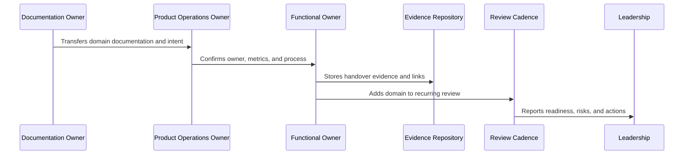
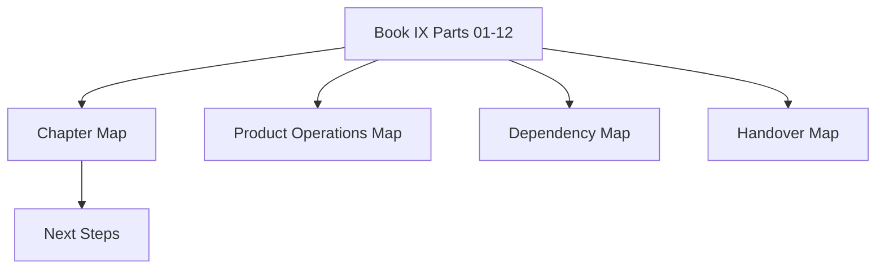

# Book IX Master Index Preparation

> *"Defines the preparation rules and file map for the separate Book IX Master Index package."*

---

# Purpose

Defines the preparation rules and file map for the separate Book IX Master Index package.

---

# Handover Problem

Without a master index, Book IX becomes harder to navigate and less useful for implementation, AI assistants, and handover.

---

# Handover Decision

## Decision

CLARA should create a dedicated Book IX Master Index after Part 12 to provide a complete navigation layer for all 144 chapters.

## Status

Accepted.

---

# Product Operations Handover Rule

Every CLARA product operations handover should connect:

```text
Domain -> Owner -> Cadence -> Metrics -> Evidence -> Escalation -> Roadmap Link -> Review Date
```

A handover is not mature if it cannot answer:

```text
who owns the domain
what process/cadence runs it
what metrics prove health
where evidence is stored
what escalation path exists
what roadmap/backlog link exists
what decisions are pending
what review date keeps it alive
```

---

# Recommended Handover Flow



---

# Production-Ready Checklist

- [ ] Owner is assigned.
- [ ] Cadence is defined.
- [ ] Metrics are defined.
- [ ] Evidence location is defined.
- [ ] Escalation path is defined.
- [ ] Related docs are linked.
- [ ] Open risks are listed.
- [ ] Action items are tracked.
- [ ] Review date is scheduled.
- [ ] AI coding assistant routing is clear.

---

# Acceptance Criteria

- [ ] Handover can be executed by a new team member.
- [ ] Product operations can continue after launch.
- [ ] Customer, support, growth, analytics, trust, reliability, AI, and cadence owners are visible.
- [ ] Book IX can be navigated from a master index.
- [ ] Decisions and evidence remain traceable.
- [ ] AI coding assistants can apply this safely.

---

# Anti-patterns

Avoid:

- Handover only as a meeting.
- No named owner.
- Metrics without review cadence.
- Cadence without decisions.
- Evidence scattered across chat.
- Roadmap items with no feedback link.
- Security/reliability/AI operations left outside product ops.
- Master index not created after final part.
- Documentation completed but not adopted.

---

# Related Documents

- ../PART-01-Product-Operations-Foundation/README.md
- ../PART-02-Customer-Onboarding-and-Success/README.md
- ../PART-03-Support-Operations-and-Knowledge-Loop/README.md
- ../PART-04-Growth-Experiments-and-Activation/README.md
- ../PART-05-Billing-Packaging-and-Monetization-Operations/README.md
- ../PART-06-Analytics-and-Product-Insights/README.md
- ../PART-07-Feedback-Prioritization-and-Roadmap-Operations/README.md
- ../PART-08-Continuous-Security-and-Compliance-Operations/README.md
- ../PART-09-Continuous-Reliability-and-Performance-Improvement/README.md
- ../PART-10-AI-Quality-and-Automation-Improvement/README.md
- ../PART-11-Business-Review-and-Operating-Cadence/README.md

---

# Navigation

**Previous:** `141-Business-Cadence-Handover.md`

**Next:** `143-Book-IX-Closure.md`

---

# Book IX Master Index Purpose

The separate Book IX Master Index should provide:

```text
complete chapter map
part-by-part navigation
dependency map
product operations map
customer/support/growth/monetization map
analytics/roadmap map
trust/reliability/AI map
business cadence map
handover map
next steps
```

---

# Recommended Master Index Files

```text
README.md
BOOK-09-MASTER-INDEX.md
BOOK-09-CHAPTER-MAP.md
BOOK-09-PRODUCT-OPERATIONS-MAP.md
BOOK-09-CUSTOMER-AND-SUPPORT-MAP.md
BOOK-09-GROWTH-MONETIZATION-MAP.md
BOOK-09-ANALYTICS-AND-ROADMAP-MAP.md
BOOK-09-TRUST-RELIABILITY-AI-MAP.md
BOOK-09-BUSINESS-CADENCE-AND-HANDOVER-MAP.md
BOOK-09-NEXT-STEPS.md
```

---

# Master Index Flow



---

# Master Index Rule

The Book IX Master Index should not introduce new policy. It should organize, connect, and route existing Book IX decisions.
