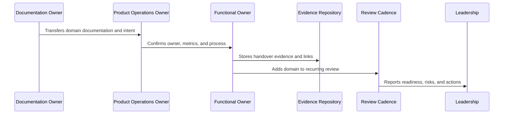

# Book IX Closure

> *"Closes Book IX by confirming that CLARA's product operations, growth, monetization, analytics, roadmap, trust, reliability, AI quality, and business cadence operating model is complete."*

---

# Purpose

Closes Book IX by confirming that CLARA's product operations, growth, monetization, analytics, roadmap, trust, reliability, AI quality, and business cadence operating model is complete.

---

# Handover Problem

Closure matters because it marks the transition from documentation creation to operational use.

---

# Handover Decision

## Decision

CLARA should treat Book IX as the product operating system after launch and connect it with Books I–VIII plus the upcoming master documentation index and repository docs.

## Status

Accepted.

---

# Product Operations Handover Rule

Every CLARA product operations handover should connect:

```text
Domain -> Owner -> Cadence -> Metrics -> Evidence -> Escalation -> Roadmap Link -> Review Date
```

A handover is not mature if it cannot answer:

```text
who owns the domain
what process/cadence runs it
what metrics prove health
where evidence is stored
what escalation path exists
what roadmap/backlog link exists
what decisions are pending
what review date keeps it alive
```

---

# Recommended Handover Flow



---

# Production-Ready Checklist

- [ ] Owner is assigned.
- [ ] Cadence is defined.
- [ ] Metrics are defined.
- [ ] Evidence location is defined.
- [ ] Escalation path is defined.
- [ ] Related docs are linked.
- [ ] Open risks are listed.
- [ ] Action items are tracked.
- [ ] Review date is scheduled.
- [ ] AI coding assistant routing is clear.

---

# Acceptance Criteria

- [ ] Handover can be executed by a new team member.
- [ ] Product operations can continue after launch.
- [ ] Customer, support, growth, analytics, trust, reliability, AI, and cadence owners are visible.
- [ ] Book IX can be navigated from a master index.
- [ ] Decisions and evidence remain traceable.
- [ ] AI coding assistants can apply this safely.

---

# Anti-patterns

Avoid:

- Handover only as a meeting.
- No named owner.
- Metrics without review cadence.
- Cadence without decisions.
- Evidence scattered across chat.
- Roadmap items with no feedback link.
- Security/reliability/AI operations left outside product ops.
- Master index not created after final part.
- Documentation completed but not adopted.

---

# Related Documents

- ../PART-01-Product-Operations-Foundation/README.md
- ../PART-02-Customer-Onboarding-and-Success/README.md
- ../PART-03-Support-Operations-and-Knowledge-Loop/README.md
- ../PART-04-Growth-Experiments-and-Activation/README.md
- ../PART-05-Billing-Packaging-and-Monetization-Operations/README.md
- ../PART-06-Analytics-and-Product-Insights/README.md
- ../PART-07-Feedback-Prioritization-and-Roadmap-Operations/README.md
- ../PART-08-Continuous-Security-and-Compliance-Operations/README.md
- ../PART-09-Continuous-Reliability-and-Performance-Improvement/README.md
- ../PART-10-AI-Quality-and-Automation-Improvement/README.md
- ../PART-11-Business-Review-and-Operating-Cadence/README.md

---

# Navigation

**Previous:** `142-Book-IX-Master-Index-Preparation.md`

**Next:** `144-Part-12-Summary.md`

---

# Book IX Completion Statement

Book IX completes CLARA's product operations system after launch.

It defines how CLARA continuously manages:

```text
customer onboarding
customer success
support learning loop
growth experiments
monetization operations
analytics and product insights
roadmap prioritization
continuous security and compliance
continuous reliability and performance
AI quality and automation
business review cadence
handover and master index preparation
```

---

# Book IX Relationship to Books I–VIII

Book IX extends:

```text
Book I   -> product mission and foundation
Book II  -> product/domain/customer model
Book III -> architecture/engineering decisions
Book IV  -> data/API/AI/integration design
Book V   -> engineering execution plan
Book VI  -> security/governance/compliance
Book VII -> operations/observability/reliability
Book VIII -> implementation/delivery/launch
```

Book IX answers:

```text
How does CLARA improve, grow, and stay trustworthy after launch?
```

---

# Closure Rule

Book IX is complete when every operating area has owner, metric, cadence, evidence, escalation, and roadmap linkage.
