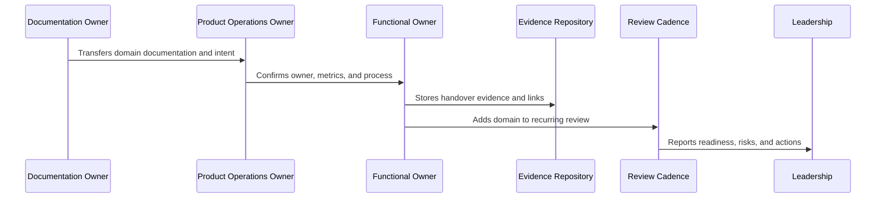

# Part 12 Summary

> *"Summarizes Product Operations Handover and Master Index and prepares the next artifact."*

---

# Purpose

Summarizes Product Operations Handover and Master Index and prepares the next artifact.

---

# Handover Problem

The Book IX Master Index comes next because all Book IX parts are now complete and need one navigation layer.

---

# Handover Decision

## Decision

CLARA should proceed to the separate BOOK-09 Master Index after completing Part 12.

## Status

Accepted.

---

# Product Operations Handover Rule

Every CLARA product operations handover should connect:

```text
Domain -> Owner -> Cadence -> Metrics -> Evidence -> Escalation -> Roadmap Link -> Review Date
```

A handover is not mature if it cannot answer:

```text
who owns the domain
what process/cadence runs it
what metrics prove health
where evidence is stored
what escalation path exists
what roadmap/backlog link exists
what decisions are pending
what review date keeps it alive
```

---

# Recommended Handover Flow



---

# Production-Ready Checklist

- [ ] Owner is assigned.
- [ ] Cadence is defined.
- [ ] Metrics are defined.
- [ ] Evidence location is defined.
- [ ] Escalation path is defined.
- [ ] Related docs are linked.
- [ ] Open risks are listed.
- [ ] Action items are tracked.
- [ ] Review date is scheduled.
- [ ] AI coding assistant routing is clear.

---

# Acceptance Criteria

- [ ] Handover can be executed by a new team member.
- [ ] Product operations can continue after launch.
- [ ] Customer, support, growth, analytics, trust, reliability, AI, and cadence owners are visible.
- [ ] Book IX can be navigated from a master index.
- [ ] Decisions and evidence remain traceable.
- [ ] AI coding assistants can apply this safely.

---

# Anti-patterns

Avoid:

- Handover only as a meeting.
- No named owner.
- Metrics without review cadence.
- Cadence without decisions.
- Evidence scattered across chat.
- Roadmap items with no feedback link.
- Security/reliability/AI operations left outside product ops.
- Master index not created after final part.
- Documentation completed but not adopted.

---

# Related Documents

- ../PART-01-Product-Operations-Foundation/README.md
- ../PART-02-Customer-Onboarding-and-Success/README.md
- ../PART-03-Support-Operations-and-Knowledge-Loop/README.md
- ../PART-04-Growth-Experiments-and-Activation/README.md
- ../PART-05-Billing-Packaging-and-Monetization-Operations/README.md
- ../PART-06-Analytics-and-Product-Insights/README.md
- ../PART-07-Feedback-Prioritization-and-Roadmap-Operations/README.md
- ../PART-08-Continuous-Security-and-Compliance-Operations/README.md
- ../PART-09-Continuous-Reliability-and-Performance-Improvement/README.md
- ../PART-10-AI-Quality-and-Automation-Improvement/README.md
- ../PART-11-Business-Review-and-Operating-Cadence/README.md

---

# Navigation

**Previous:** `143-Book-IX-Closure.md`

**Next:** `../BOOK-09-Master-Index/README.md`

---

# Part 12 Completion

Part 12 establishes:

- Product operations handover and master index overview.
- Product operations readiness checklist.
- Customer operations handover.
- Support and knowledge loop handover.
- Growth and monetization handover.
- Analytics and roadmap handover.
- Security and reliability continuous ops handover.
- AI quality and automation handover.
- Business cadence handover.
- Book IX master index preparation.
- Book IX closure.

---

# Book IX Completion

```text
BOOK IX — Product Operations, Growth & Continuous Improvement
Status: Complete
Total Parts: 12
Total Chapters: 144
Next Artifact: BOOK-09 Master Index
```

---

# Recommended Next Step

Create:

```text
BOOK-09-Master-Index
```

Target path:

```text
docs/BOOK-09-Product-Operations-Growth-and-Continuous-Improvement/BOOK-09-Master-Index/
```

After that, CLARA can proceed to:

```text
CLARA Master Documentation Index
Repository Root Documentation Pack
Repository Skeleton ZIP
AGENTS.md / AI coding assistant instructions
Initial implementation setup
```

---

# Final Rule

Product operations documentation becomes valuable only when it is used in real cadence, real decisions, and real customer learning.
