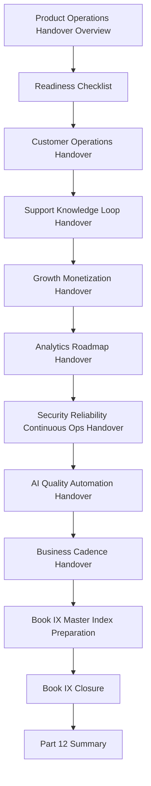

# PART-12 — Product Operations Handover and Master Index

> *"A product operations system is complete only when the right owners, cadences, evidence, metrics, and decisions can continue without the original authors in the room."*

---

# Purpose

Part 12 closes Book IX and defines the handover model for CLARA product operations after launch.

It covers:

- Product Operations Handover and Master Index Overview.
- Product Operations Readiness Checklist.
- Customer Operations Handover.
- Support and Knowledge Loop Handover.
- Growth and Monetization Handover.
- Analytics and Roadmap Handover.
- Security and Reliability Continuous Ops Handover.
- AI Quality and Automation Handover.
- Business Cadence Handover.
- Book IX Master Index Preparation.
- Book IX Closure.
- Part 12 Summary.

---

# Chapter Map

| Chapter | Title |
|---:|---|
| 133 | Product Operations Handover and Master Index Overview |
| 134 | Product Operations Readiness Checklist |
| 135 | Customer Operations Handover |
| 136 | Support and Knowledge Loop Handover |
| 137 | Growth and Monetization Handover |
| 138 | Analytics and Roadmap Handover |
| 139 | Security and Reliability Continuous Ops Handover |
| 140 | AI Quality and Automation Handover |
| 141 | Business Cadence Handover |
| 142 | Book IX Master Index Preparation |
| 143 | Book IX Closure |
| 144 | Part 12 Summary |

---

# Handover Map



---

# Book IX Completion Status

```text
PART-01 Product Operations Foundation ✅
PART-02 Customer Onboarding and Success ✅
PART-03 Support Operations and Knowledge Loop ✅
PART-04 Growth Experiments and Activation ✅
PART-05 Billing Packaging and Monetization Operations ✅
PART-06 Analytics and Product Insights ✅
PART-07 Feedback Prioritization and Roadmap Operations ✅
PART-08 Continuous Security and Compliance Operations ✅
PART-09 Continuous Reliability and Performance Improvement ✅
PART-10 AI Quality and Automation Improvement ✅
PART-11 Business Review and Operating Cadence ✅
PART-12 Product Operations Handover and Master Index ✅
```

---

# Product Operations Non-Negotiables

CLARA product operations handover must preserve:

```text
clear owners
clear metrics
clear review cadence
clear escalation path
clear evidence location
clear roadmap linkage
clear customer impact view
clear trust/risk view
clear AI quality view
clear business review flow
clear action tracking
clear documentation navigation
```

---

# Relationship to Previous Part

Part 11 defines business review and operating cadence.

Part 12 converts the full Book IX system into an operational handover and prepares the separate Book IX Master Index.

---

# Navigation

**Previous:** `../PART-11-Business-Review-and-Operating-Cadence/132-Part-11-Summary.md`

**Next:** `133-Product-Operations-Handover-and-Master-Index-Overview.md`
