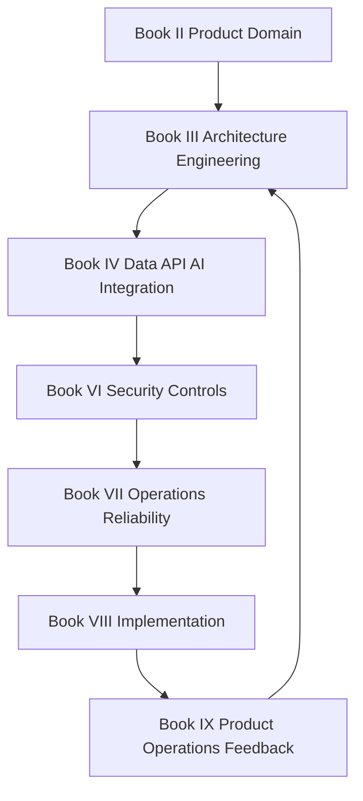

# CLARA Architecture Map

> *"Architecture prevents a growing product from becoming accidental complexity."*

---

# Purpose

This document routes architecture-related work to the correct CLARA books.

---

# Primary Sources

```text
BOOK III — Architecture & Engineering
BOOK IV  — Data, API, AI & Integration Design
BOOK VIII — Implementation, Delivery & Production Launch
```

---

# Supporting Sources

```text
BOOK II  — Product & Domain
BOOK VI  — Security, Governance & Compliance
BOOK VII — Operations, Observability & Reliability
BOOK IX  — Product Operations, Growth & Continuous Improvement
```

---

# Architecture Routing

| Topic | Primary Book | Supporting Book |
|---|---|---|
| System architecture | BOOK III | BOOK VIII |
| Module boundaries | BOOK III | BOOK VIII |
| ADRs | BOOK III | BOOK VI |
| API contracts | BOOK IV | BOOK VIII |
| Database/data model | BOOK IV | BOOK VIII |
| AI architecture | BOOK IV | BOOK VI, BOOK VIII, BOOK IX |
| Integration/webhook architecture | BOOK IV | BOOK VI, BOOK VII, BOOK VIII |
| Auth/authz architecture | BOOK III | BOOK VI, BOOK VIII |
| Observability architecture | BOOK VII | BOOK VIII |
| Deployment architecture | BOOK VIII | BOOK VII |
| Post-launch architecture feedback | BOOK IX | BOOK III, BOOK VII |

---

# Architecture Dependency Flow



---

# Architecture Decision Checklist

Before implementing architecture-sensitive changes:

```text
check product/domain behavior
check existing ADRs
check API/data contracts
check tenant/workspace boundaries
check auth/authz impact
check privacy/data handling
check observability requirements
check rollback/degraded mode
check product operations impact
```

---

# Production Rule

```text
Architecture decisions must be documented before they become code patterns.
```

---

# Anti-Patterns

Avoid:

```text
feature-specific architecture hacks
bypassing module boundaries
adding hidden cross-service dependencies
putting business logic in controllers/UI only
changing API/data contracts without docs
adding AI/integration behavior without observability
shipping architecture change without rollback plan
```
