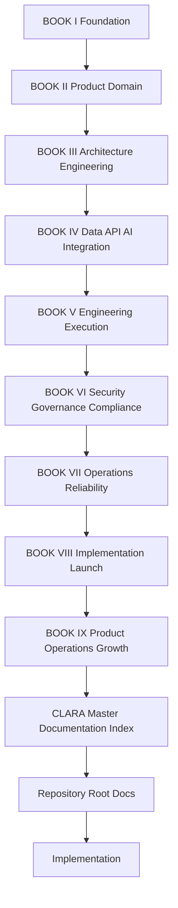

# CLARA Document Dependency Map

> *"Document dependencies prevent implementation from drifting away from product, architecture, security, operations, and product operations decisions."*

---

# Purpose

This document defines the safe reading order and dependency relationships between CLARA books.

---

# Primary Dependency Chain



---

# Dependency Rules

## Product Work

```text
Book II -> Book IX -> Book VIII
```

## Backend/API Work

```text
Book II -> Book III -> Book IV -> Book VI -> Book VIII -> Book VII
```

## Database Work

```text
Book IV -> Book VI -> Book VIII -> Book VII
```

## Frontend Work

```text
Book II -> Book VI -> Book VIII -> Book IX
```

## AI Work

```text
Book IV -> Book VI -> Book VIII -> Book IX -> Book VII
```

## Integration/Webhook Work

```text
Book IV -> Book VI -> Book VII -> Book VIII -> Book IX
```

## Security Work

```text
Book VI -> Book VIII -> Book VII -> Book IX
```

## Operations Work

```text
Book VII -> Book VIII -> Book IX
```

## Growth/Product Ops Work

```text
Book IX -> Book II -> Book VIII
```

---

# Dependency Safety Rule

```text
If a change touches multiple concerns, read all relevant dependency chains before implementation.
```

---

# High-Risk Change Routing

| Change Type | Required Docs |
|---|---|
| Auth/authz | BOOK VI, BOOK III, BOOK VIII |
| Tenant data access | BOOK IV, BOOK VI, BOOK VIII |
| AI output/action | BOOK IV, BOOK VI, BOOK VIII, BOOK IX |
| Billing/entitlement | BOOK IX, BOOK VI, BOOK VIII |
| Webhook/integration | BOOK IV, BOOK VI, BOOK VII, BOOK VIII |
| Migration/data deletion | BOOK IV, BOOK VI, BOOK VII, BOOK VIII |
| Production deployment | BOOK VII, BOOK VIII |
| Customer-facing growth experiment | BOOK IX, BOOK VI, BOOK VIII |
