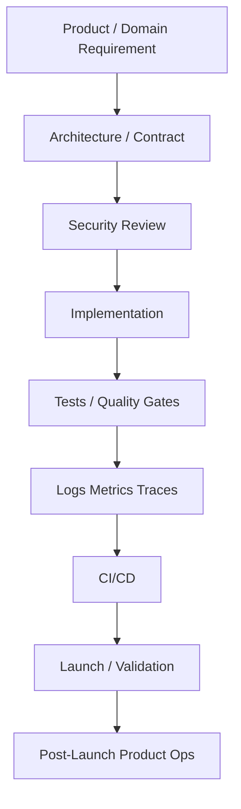

# CLARA Implementation Map

> *"Implementation should be boring in the best way: consistent, secure, testable, observable, and easy to review."*

---

# Purpose

This document routes implementation work to the correct standards.

---

# Primary Source

```text
BOOK VIII — Implementation, Delivery & Production Launch
```

---

# Supporting Sources

```text
BOOK III — Architecture & Engineering
BOOK IV — Data, API, AI & Integration Design
BOOK VI — Security, Governance & Compliance
BOOK VII — Operations, Observability & Reliability
BOOK IX — Product Operations, Growth & Continuous Improvement
```

---

# Implementation Routing

| Work Type | Primary Book VIII Part | Required Supporting Docs |
|---|---|---|
| Repository/module setup | PART-02 | BOOK III |
| Backend implementation | PART-03 | BOOK VI, BOOK VII |
| Frontend/client implementation | PART-04 | BOOK VI |
| Database/migrations | PART-05 | BOOK IV, BOOK VI, BOOK VII |
| AI Gateway/automation | PART-06 | BOOK IV, BOOK VI, BOOK IX |
| Integrations/webhooks | PART-07 | BOOK IV, BOOK VI, BOOK VII |
| Testing/quality | PART-08 | BOOK VI, BOOK VII |
| CI/CD/environment | PART-09 | BOOK VI, BOOK VII |
| Production launch | PART-10 | BOOK VII |
| Production validation/hardening | PART-11 | BOOK VII, BOOK IX |
| Handover | PART-12 | BOOK VII, BOOK IX |

---

# Implementation Flow



---

# Coding Readiness Checklist

Before coding a module:

```text
relevant book/part identified?
API/data contract known?
security constraints known?
auth/authz rules known?
validation rules known?
test strategy known?
observability requirements known?
deployment/rollback expectations known?
product operations impact known?
```

---

# Implementation Non-Negotiables

```text
business logic separated from controllers/UI
server-side authorization
schema validation for external input
no secrets in code
database migrations reviewed
tests for critical paths
observability for production workflows
feature flags for risky rollout
rollback path for high-impact changes
```
