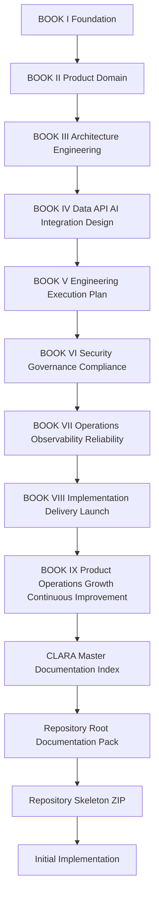

# CLARA Master Index

> *"CLARA documentation is the operating system for building, launching, operating, and continuously improving the product safely."*

---

# Document Identity

```text
Project: CLARA
Scope: BOOK I–IX
Status: Core + Product Operations Documentation Complete
Purpose: Prepare for root repository documentation and coding setup
Next Artifact: Repository Root Documentation Pack
```

---

# Master Book Table

| Book | Title | Path | Main Responsibility |
|---|---|---|---|
| BOOK I | Foundation | `docs/BOOK-01-Foundation/` | Defines CLARA's identity, mission, principles, product intent, vocabulary, and baseline direction. |
| BOOK II | Product & Domain | `docs/BOOK-02-Product-and-Domain/` | Defines product domain, users, roles, workflows, business entities, requirements, and product behavior. |
| BOOK III | Architecture & Engineering | `docs/BOOK-03-Architecture-and-Engineering/` | Defines architecture decisions, engineering principles, module boundaries, ADRs, and technical design patterns. |
| BOOK IV | Data, API, AI & Integration Design | `docs/BOOK-04-Data-API-AI-and-Integration-Design/` | Defines data model, API contracts, AI design, integration contracts, events, and technical interfaces. |
| BOOK V | Engineering Execution Plan | `docs/BOOK-05-Engineering-Execution-Plan/` | Defines execution roadmap, backlog, task breakdown, implementation phases, and delivery planning. |
| BOOK VI | Security, Governance & Compliance | `docs/BOOK-06-Security-Governance-and-Compliance/` | Defines secure-by-design controls, governance, risk model, compliance evidence, privacy, and operational trust. |
| BOOK VII | Operations, Observability & Reliability | `docs/BOOK-07-Operations-Observability-and-Reliability/` | Defines production operations, observability, alerting, incident response, reliability, performance, backup/restore, SLOs, and runbooks. |
| BOOK VIII | Implementation, Delivery & Production Launch | `docs/BOOK-08-Implementation-Delivery-and-Production-Launch/` | Defines implementation standards, repo/module structure, backend/frontend/database/AI/integration implementation, CI/CD, launch, hardening, and handover. |
| BOOK IX | Product Operations, Growth & Continuous Improvement | `docs/BOOK-09-Product-Operations-Growth-and-Continuous-Improvement/` | Defines post-launch product operations, customer success, support loop, growth, monetization, analytics, roadmap, continuous trust, reliability, AI quality, business cadence, and handover. |

---

# Master System Flow



---

# What Is Complete

CLARA now has documentation for:

```text
foundation
product/domain
architecture/engineering
data/API/AI/integration design
engineering execution
security/governance/compliance
operations/observability/reliability
implementation/delivery/launch
post-launch product operations/growth/improvement
```

---

# What This Index Does

This index provides:

```text
book navigation
dependency routing
architecture routing
security routing
operations routing
implementation routing
product operations routing
AI coding assistant routing
next-step sequence
```

---

# Source of Truth Priority

When documents overlap, use this priority:

```text
1. Security, privacy, compliance, and trust constraints
2. Architecture and ADR decisions
3. Product/domain behavior and customer requirements
4. Data/API/AI/integration contracts
5. Implementation standards
6. Operations/reliability/SLO/runbooks
7. Product operations/growth/analytics/roadmap cadence
8. Backlog/task planning
```

---

# Golden Rule

```text
No production code should be written from memory when a relevant CLARA document exists.
```

---

# AI Coding Assistant Rule

Any AI coding assistant working on CLARA should:

```text
read root AGENTS.md first after it exists
read this master index
identify the relevant book/part
follow Book VIII for implementation standards
follow Book VI for security and compliance controls
follow Book VII for operations/reliability expectations
follow Book IX for product operations/growth/post-launch implications
avoid inventing architecture outside documented decisions
avoid hard-coded secrets
avoid bypassing authorization
avoid collecting unnecessary sensitive data
```
