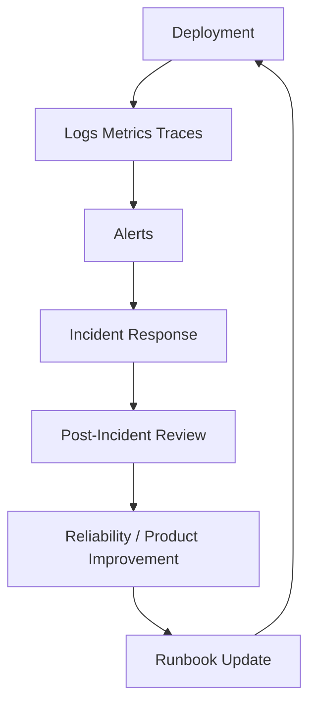

# CLARA Operations Map

> *"Production is not only deployed code. Production is code plus monitoring, response, recovery, reliability, and ownership."*

---

# Purpose

This document routes operations, observability, reliability, incident, SLO, and support-operation concerns.

---

# Primary Sources

```text
BOOK VII — Operations, Observability & Reliability
BOOK VIII — Implementation, Delivery & Production Launch
BOOK IX — Product Operations, Growth & Continuous Improvement
```

---

# Supporting Sources

```text
BOOK VI — Security, Governance & Compliance
BOOK IV — Data, API, AI & Integration Design
```

---

# Operations Routing

| Topic | Primary Book | Supporting Book |
|---|---|---|
| Production operating model | BOOK VII | BOOK VIII |
| Observability strategy | BOOK VII | BOOK VIII |
| Logging standards | BOOK VII | BOOK VIII |
| Metrics standards | BOOK VII | BOOK IX |
| Alerting | BOOK VII | BOOK VIII |
| Incident operations | BOOK VII | BOOK IX |
| Reliability engineering | BOOK VII | BOOK IX |
| Performance/capacity | BOOK VII | BOOK VIII, BOOK IX |
| Backup/restore/DR | BOOK VII | BOOK VIII |
| Production support operations | BOOK VII | BOOK IX |
| Runbooks/playbooks | BOOK VII | BOOK VIII |
| SLOs/error budgets | BOOK VII | BOOK IX |
| Operational security | BOOK VII | BOOK VI |
| Continuous reliability improvement | BOOK IX | BOOK VII |
| Customer-impact reliability analytics | BOOK IX | BOOK VII |

---

# Operations Flow



---

# Production Readiness Checklist

Before launch or production change:

```text
logs implemented?
metrics implemented?
trace/correlation IDs implemented?
alerts defined?
dashboards available?
runbook exists?
rollback plan exists?
backup/restore considered?
SLO impact understood?
support impact understood?
customer communication path known?
```

---

# Operations Rule

```text
A feature is not production-ready until it is observable, supportable, reversible, and recoverable.
```
