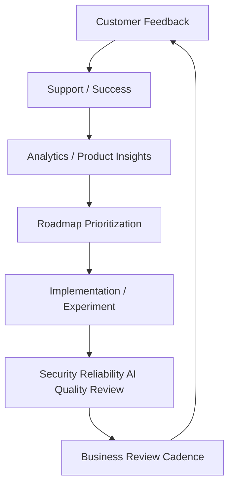

# CLARA Product Operations Map

> *"After launch, CLARA must keep learning from customers, support, metrics, reliability, security, AI, and revenue signals."*

---

# Purpose

This document routes post-launch product operations and continuous improvement work.

---

# Primary Source

```text
BOOK IX — Product Operations, Growth & Continuous Improvement
```

---

# Supporting Sources

```text
BOOK II — Product & Domain
BOOK VI — Security, Governance & Compliance
BOOK VII — Operations, Observability & Reliability
BOOK VIII — Implementation, Delivery & Production Launch
```

---

# Book IX Routing

| Topic | Book IX Part |
|---|---|
| Product operations foundation | PART-01 |
| Customer onboarding and success | PART-02 |
| Support operations and knowledge loop | PART-03 |
| Growth experiments and activation | PART-04 |
| Billing, packaging, monetization | PART-05 |
| Analytics and product insights | PART-06 |
| Feedback prioritization and roadmap | PART-07 |
| Continuous security/compliance ops | PART-08 |
| Continuous reliability/performance | PART-09 |
| AI quality and automation improvement | PART-10 |
| Business review and operating cadence | PART-11 |
| Product operations handover | PART-12 |

---

# Product Operations Loop



---

# Product Operations Non-Negotiables

```text
customer evidence over opinion
support themes feed product roadmap
analytics supports decisions
growth experiments use guardrails
monetization avoids dark patterns
security/reliability/AI quality stay continuous
business reviews produce owners and actions
handover requires owner, cadence, metric, evidence, escalation, roadmap link
```

---

# When to Use This Map

Use this map when working on:

```text
customer onboarding
support process
knowledge base
growth experiments
analytics events
roadmap prioritization
billing/entitlements
AI quality improvement
business review reports
post-launch continuous improvement
```
