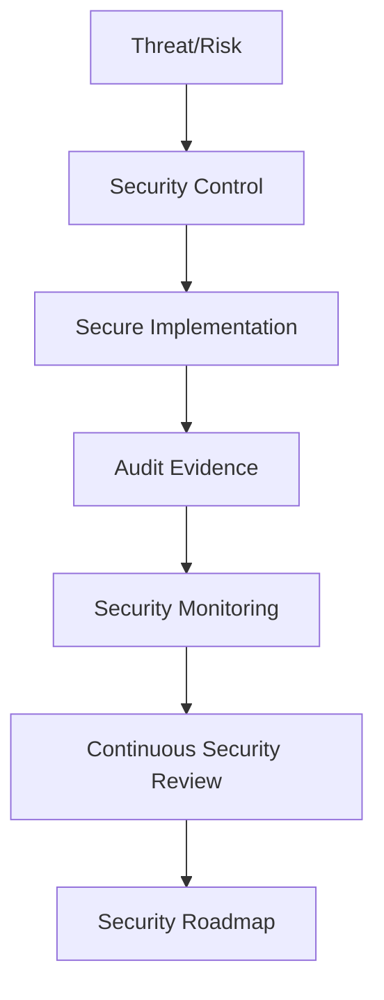

# CLARA Security Governance Map

> *"Security is not a layer added at the end. Security is a product and engineering constraint from the start."*

---

# Purpose

This document routes security, privacy, governance, compliance, and trust work.

---

# Primary Sources

```text
BOOK VI — Security, Governance & Compliance
BOOK VIII — Implementation, Delivery & Production Launch
BOOK IX — Product Operations, Growth & Continuous Improvement
```

---

# Supporting Sources

```text
BOOK III — Architecture & Engineering
BOOK IV — Data, API, AI & Integration Design
BOOK VII — Operations, Observability & Reliability
```

---

# Security Routing

| Topic | Primary Book | Supporting Book |
|---|---|---|
| Authentication | BOOK VI | BOOK VIII |
| Authorization/RBAC | BOOK VI | BOOK III, BOOK VIII |
| Tenant/workspace isolation | BOOK VI | BOOK IV, BOOK VIII |
| Secure coding | BOOK VI | BOOK VIII |
| Input validation | BOOK VI | BOOK VIII |
| Output encoding/XSS prevention | BOOK VI | BOOK VIII |
| SQL/NoSQL injection prevention | BOOK VI | BOOK VIII |
| CSRF/session security | BOOK VI | BOOK VIII |
| Secrets management | BOOK VI | BOOK VIII |
| Audit logging | BOOK VI | BOOK VII, BOOK VIII |
| Privacy/data handling | BOOK VI | BOOK IX |
| Compliance evidence | BOOK VI | BOOK IX |
| Security monitoring | BOOK VII | BOOK VI |
| Continuous access review | BOOK IX | BOOK VI |
| Vulnerability/patch cadence | BOOK IX | BOOK VI |
| AI safety | BOOK VI | BOOK IV, BOOK VIII, BOOK IX |
| Webhook verification | BOOK VI | BOOK IV, BOOK VIII |

---

# Security Trust Flow



---

# Secure-by-Design Checklist

Before coding:

```text
authentication required?
authorization checked server-side?
tenant/workspace scope enforced?
input validated?
output encoded?
secrets loaded from env/secret manager?
sensitive data minimized?
audit event needed?
rate limit needed?
webhook signature needed?
AI safety guardrail needed?
logs free from secrets/PII?
```

---

# Security Non-Negotiables

```text
never trust client-side authorization
never hard-code secrets
never log secrets or tokens
never expose cross-tenant data
never skip validation for external input
never ship debug mode to production
never process unnecessary sensitive data
never automate high-impact AI actions without guardrails
```

---

# Production Rule

```text
If a feature changes data access, identity, permissions, AI behavior, billing access, or external integrations, security review is required.
```
