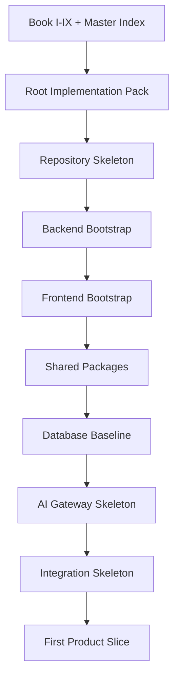

# 01 — Implementation Transition Strategy

> *"Implementation should begin only after the documentation system has become an executable operating agreement."*

---

# Purpose

This document defines the transition strategy from a documentation-first repository to an implementation-ready repository.

---

# Current State

The official CLARA repository currently acts as:

```text
documentation library
architecture record
security and governance reference
product/domain blueprint
engineering execution plan
operations model
product operations system
```

The next step is to add implementation scaffolding without losing documentation clarity.

---

# Transition Goals

The transition should achieve:

```text
clear repo structure
clear module boundaries
clear security baseline
clear AI coding assistant rules
clear first milestone
clear validation checks
clear PR sequence
```

---

# What This Transition Is Not

This transition is not:

```text
full product implementation
feature development
database schema finalization
UI buildout
AI automation buildout
production deployment
```

Those come later.

---

# Recommended Transition Phases

```text
Phase 0 — Documentation Import Completed
Phase 1 — Root Implementation Pack
Phase 2 — Repository Skeleton PR
Phase 3 — Backend Bootstrap PR
Phase 4 — Frontend/Dashboard Bootstrap PR
Phase 5 — Shared Package and Config PR
Phase 6 — Database and Migration Baseline PR
Phase 7 — AI Gateway Skeleton PR
Phase 8 — Integration Skeleton PR
Phase 9 — First Product Slice PR
```

---

# Transition Flow



---

# Decision

CLARA should move into implementation through small, reviewable foundation PRs.

---

# Why

Large “first code” commits create:

```text
hard-to-review architecture drift
security mistakes
unclear ownership
weak rollback
AI assistant confusion
inconsistent patterns
```

Small foundation PRs create:

```text
reviewable decisions
consistent patterns
safe baseline
clear testing gates
better AI assistant behavior
```

---

# Transition Rule

```text
Each implementation PR must reference the documentation that governs it.
```
