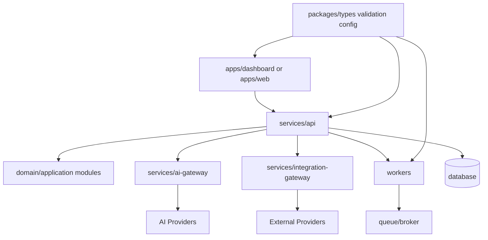

# 04 — Module Boundary Plan

> *"Most architecture problems start when boundaries are implied instead of explicit."*

---

# Purpose

This document defines early module boundaries for CLARA implementation.

---

# Boundary Principles

CLARA should separate:

```text
UI from business logic
API transport from application services
application services from domain rules
domain rules from infrastructure providers
AI gateway from product modules
integration gateway from product modules
workers from synchronous API flow
shared contracts from feature implementation
```

---

# Initial Module Boundary Map



---

# Suggested Service Boundaries

## `services/api`

Responsible for:

```text
HTTP API
auth/session verification
authorization enforcement
tenant/workspace scoping
application service orchestration
database transactions
audit event emission
```

Should not:

```text
call AI providers directly outside AI Gateway abstraction
call third-party integration providers directly outside Integration Gateway
contain frontend-specific UI logic
```

---

## `services/ai-gateway`

Responsible for:

```text
prompt execution boundary
RAG context preparation
AI provider routing
AI safety checks
AI output validation
AI cost/latency metrics
fallback/rollback support
```

Should not:

```text
own product business rules
bypass tenant data permissions
store raw secrets in code
```

---

## `services/integration-gateway`

Responsible for:

```text
external provider connection
webhook verification
idempotency
retry/backoff
rate limit handling
provider-specific adapters
integration health metrics
```

Should not:

```text
trust incoming webhook payloads without verification
mix provider payloads directly into product domain without normalization
```

---

## `workers/`

Responsible for:

```text
background jobs
async automation
ingestion
notifications
scheduled tasks
retryable workflows
```

Should not:

```text
perform high-impact irreversible actions without idempotency and audit logging
```

---

## `packages/`

Responsible for:

```text
shared types
validation schemas
config helpers
UI primitives
common utilities
```

Should not:

```text
contain runtime secrets
contain service-specific business workflows
```

---

# Boundary Enforcement Checklist

For every new module:

- [ ] Responsibility is clear.
- [ ] Owner is clear.
- [ ] Dependencies are clear.
- [ ] Security boundary is clear.
- [ ] Observability expectation is clear.
- [ ] Tests can be written in isolation.
- [ ] No circular dependency is introduced.

---

# Boundary Rule

```text
If a module needs to know too much about another module, the boundary is wrong or the contract is missing.
```
