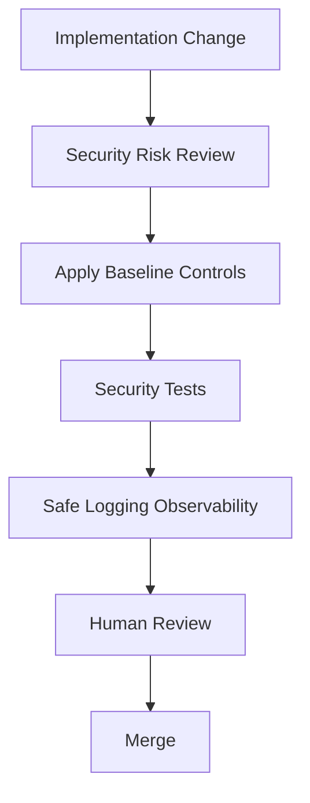

# 06 — Security Baseline for Implementation

> *"The first implementation commit should already behave like it will eventually run in production."*

---

# Purpose

This document defines the minimum security baseline before CLARA starts implementation.

---

# Security Baseline

Every implementation PR must preserve:

```text
no committed secrets
secure environment variable handling
server-side authorization design
tenant/workspace scope design
input validation pattern
safe error handling
safe logging
auditability for privileged workflows
dependency review
testability
```

---

# Baseline Controls

## Secrets

Rules:

```text
no real .env committed
.env.example uses placeholders only
secrets loaded from environment
production secrets managed outside git
```

## Authentication

Rules:

```text
auth boundary documented before protected endpoints
session/JWT handling documented
no auth bypass in production code
```

## Authorization

Rules:

```text
server-side authorization required
frontend role check is UX only
queries must be scoped
privileged actions require audit event
```

## Tenant Isolation

Rules:

```text
organization/workspace/customer scope enforced
cross-tenant query impossible by default
tests cover unauthorized access
```

## Input Validation

Rules:

```text
validate all external input
validate webhooks
validate API request bodies
validate AI/tool inputs
```

## Output Safety

Rules:

```text
no secrets in responses
no internal stack trace in production response
encode/sanitize user-controlled output
```

## Logging

Rules:

```text
structured logs
correlation id
no tokens/cookies/secrets
no raw customer transcript unless explicitly approved
redaction utility for sensitive data
```

## AI Safety

Rules:

```text
AI output untrusted
prompt/RAG versioning
guardrails for high-impact actions
human review where required
fallback/kill switch for risky automation
```

---

# Security Baseline Flow



---

# Required Tests for Security-Sensitive Changes

```text
unauthenticated request rejected
unauthorized role rejected
cross-tenant access rejected
invalid input rejected
secret not exposed
audit event emitted where needed
```

---

# Implementation Blockers

Block merge if:

```text
real secret committed
authorization missing
tenant scope missing
AI high-impact action lacks guardrail
logs expose sensitive data
migration destructive without rollback
tests missing for critical security path
```

---

# Security Rule

```text
Security baseline must exist before feature velocity.
```
