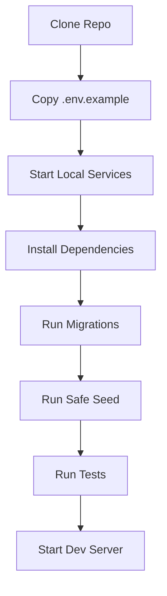

# 07 — Development Environment Plan

> *"A good local environment lets junior developers move fast without learning unsafe production habits."*

---

# Purpose

This document defines the recommended local development environment plan for CLARA.

---

# Goals

The local environment should be:

```text
easy to start
safe by default
secret-safe
similar enough to production patterns
testable
observable
documented
```

---

# Recommended Tooling

Initial tooling may include:

```text
Node.js LTS
Python or TypeScript backend runtime depending final stack
Docker Compose
PostgreSQL
Redis
pnpm or npm
GitHub Actions
prettier/eslint or ruff depending language
test runner
```

Stack should be finalized based on Book VIII implementation decisions.

---

# Root Environment Files

Use:

```text
.env.example
.env.local.example
```

Do not commit:

```text
.env
.env.local
.env.production
```

---

# Local Services

Recommended local services:

```text
postgres
redis
mailpit or mock email
mock external provider
mock AI provider mode
```

---

# Local Docker Compose Target

Future path:

```text
infra/local/docker-compose.yml
```

Should include:

```text
postgres
redis
optional local object storage
optional mock provider services
```

---

# Developer Commands

Future root commands may include:

```bash
npm run dev
npm run test
npm run lint
npm run typecheck
npm run format
npm run docs:check
```

Or equivalent if pnpm/turborepo/nx is selected.

---

# Environment Safety Rules

Local setup must not require:

```text
production secrets
real customer data
manual database edits
unsafe admin bypasses
committed tokens
```

---

# Local Development Flow



---

# First Environment Milestone

The first milestone should support:

```text
health endpoint
config loading
test runner
structured logging
correlation id
CI check
```

---

# Dev Env Rule

```text
Local development must not require weakening security controls.
```
