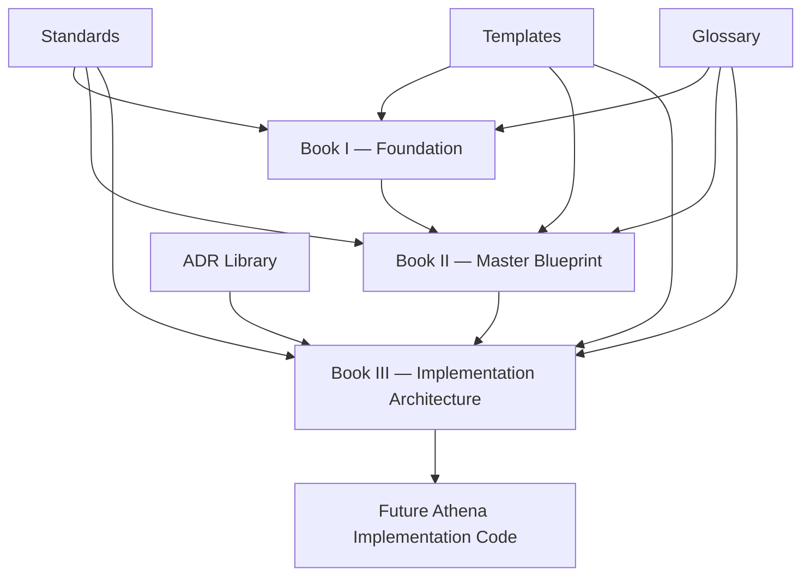

# Athena Book Dependency Map

```mermaid
flowchart TD
    B1[Book I — Foundation] --> B2[Book II — Master Blueprint]
    B2 --> B3[Book III — Implementation Architecture]
    B3 --> Code[Future Athena Implementation Code]
    Standards[Standards] --> B1
    Standards --> B2
    Standards --> B3
    Templates[Templates] --> B1
    Templates --> B2
    Templates --> B3
    Glossary[Glossary] --> B1
    Glossary --> B2
    Glossary --> B3
    ADR[ADR Library] --> B3
```

# Navigation

**Back:** `README.md`
