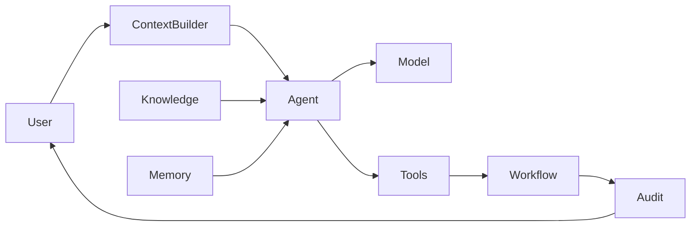
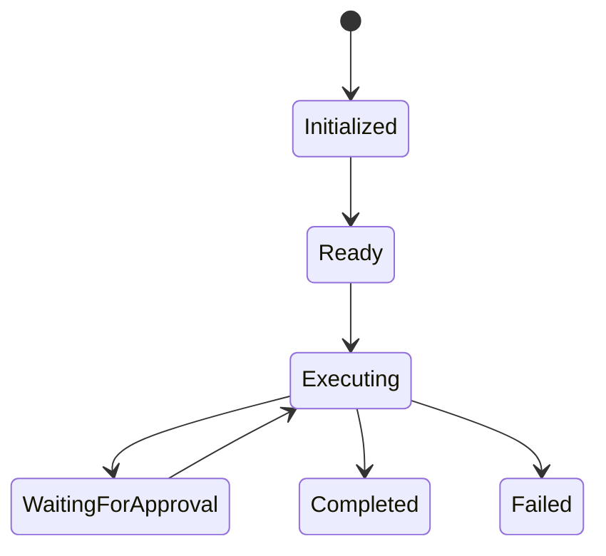

# AI Agent

> *"An AI Agent is an autonomous software actor that perceives context, reasons within defined boundaries, uses approved tools, and performs tasks toward a goal."*

---

## Document Information

| Field | Value |
|---|---|
| Term | AI Agent |
| Category | AI / Platform |
| Status | Official |
| Owner | Athena Core Team |
| Last Updated | 2026-07-06 |

---

# Definition

An **AI Agent** is a software entity that can understand objectives, gather context, reason over available information, use authorized tools, and execute actions within defined security and governance constraints.

Unlike a traditional chatbot, an AI Agent can perform multi-step tasks while remaining accountable and observable.

---

# Purpose

AI Agents exist to:

- Assist users.
- Automate repetitive work.
- Coordinate workflows.
- Use enterprise tools safely.
- Improve decision support.
- Collaborate with humans.

---

# Core Capabilities

- Understand user intent.
- Build execution context.
- Retrieve knowledge.
- Use memory appropriately.
- Call authorized tools.
- Produce structured outputs.
- Escalate when confidence is low.
- Learn through approved feedback loops.

---

# Architecture



---

# Relationship to Other Concepts

## Context

The Agent receives task-specific Context.

## Knowledge

The Agent retrieves authorized Knowledge when needed.

## Memory

The Agent may read or update Memory according to policy.

## Model

The Agent uses one or more AI Models to perform reasoning.

## Workflow

The Agent may initiate or participate in Workflows.

---

# Agent Lifecycle



---

# Tool Calling

Agents should only invoke approved tools.

Each tool must define:

- Purpose
- Required permissions
- Inputs
- Outputs
- Side effects
- Failure behavior

Tool execution must be auditable.

---

# Human-in-the-Loop

Sensitive operations should support human approval.

Examples:

- Sending external communications.
- Deleting records.
- Financial actions.
- Permission changes.
- High-risk AI recommendations.

---

# Security Considerations

Every Agent must enforce:

- Authentication
- Authorization
- Least privilege
- Prompt injection mitigation
- Tenant/workspace isolation
- Secret protection
- Audit logging
- Tool permission boundaries

Agents must never bypass platform security controls.

---

# Observability

Capture:

- Agent version
- Model version
- Prompt version
- Tool usage
- Context sources
- Execution latency
- Failures
- Confidence score
- Correlation ID

---

# Common Agent Types

- Customer Support Agent
- Sales Assistant
- Knowledge Assistant
- Workflow Agent
- CRM Agent
- Coding Assistant
- Incident Response Agent
- Analytics Agent

---

# Anti-Patterns

Avoid:

- Unlimited tool access.
- Hidden autonomous behavior.
- Long-term memory without governance.
- Executing destructive actions without approval.
- Ignoring authorization checks.
- Opaque reasoning for critical workflows.

---

# Preferred Usage

Use:

```text
AI Agent
```

Avoid treating these as synonyms:

```text
Bot
Assistant
Model
LLM
Script
```

An AI Agent may use an LLM, but it is a broader architectural concept.

---

# Related Terms

- Model
- Context
- Memory
- Knowledge
- Workflow
- Tool Calling
- Prompt
- User
- Permission

---

# References

- Book V — AI Bible
- AI Specification Template
- docs/standards/AI-DOCUMENTATION-STANDARD.md
- docs/standards/GLOSSARY-STANDARD.md
