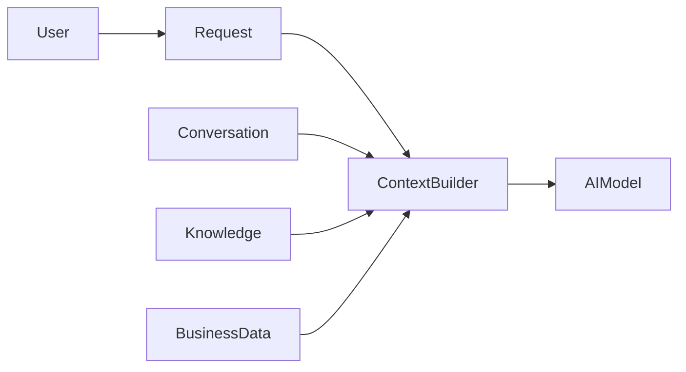

# Context

> *"Context is the information that gives meaning to an AI decision."*

---

## Document Information

| Field | Value |
|---|---|
| Term | Context |
| Category | AI / Architecture |
| Status | Official |
| Owner | Clara Core Team |
| Last Updated | 2026-07-06 |

---

# Definition

A **Context** is the collection of relevant information supplied to an AI model, workflow, or service so it can make accurate, safe, and useful decisions.

Context is not permanent memory. It is assembled for a specific task or interaction.

---

# Purpose

Context exists to:

- Improve AI response quality.
- Reduce hallucinations.
- Provide business awareness.
- Enforce security boundaries.
- Personalize behavior.
- Support deterministic workflows.

---

# Types of Context

## Conversation Context

Recent messages within the active conversation.

## User Context

Information about the authenticated user, role, workspace, and preferences.

## Business Context

Relevant customer, ticket, workflow, or operational data.

## Knowledge Context

Retrieved documentation, policies, FAQs, and indexed content.

## System Context

Current system state, configuration, feature flags, and environment.

---

# Context Assembly



Context should be assembled dynamically based on the task.

---

# Context Principles

- Relevant
- Minimal
- Authorized
- Fresh
- Traceable
- Explainable

Only include information required for the current task.

---

# Relationship to Memory

Context and Memory are different concepts.

```text
Memory
    ↓ retrieves
Relevant Information
    ↓
Context
    ↓
AI Execution
```

Memory stores information over time.

Context is the information actively provided to complete one task.

---

# Relationship to Knowledge

Knowledge is a source.

Context is the selected subset delivered to the AI.

```text
Knowledge Base
      ↓
Retrieval
      ↓
Context
```

---

# Security Considerations

Context must respect:

- Authentication
- Authorization
- Tenant isolation
- Workspace isolation
- Data minimization
- Least privilege

Sensitive information must never be included unless required and authorized.

---

# Privacy Considerations

Avoid exposing:

- Unnecessary personal data
- Secrets
- API keys
- Credentials
- Hidden system prompts
- Restricted customer information

---

# Observability

Record:

- Context sources
- Retrieval latency
- Context size
- Retrieval failures
- Context version
- Correlation ID

Avoid logging sensitive context contents unless explicitly permitted.

---

# Anti-Patterns

Avoid:

- Passing the entire database.
- Using stale information.
- Ignoring authorization.
- Mixing unrelated domains.
- Hidden context sources.
- Excessively large prompts.

---

# Common Examples

Examples of context:

- Last 20 chat messages.
- Customer profile.
- Open support ticket.
- Organization policy.
- Relevant knowledge articles.
- Active workflow state.

---

# Preferred Usage

Use:

```text
Context
```

Avoid using as direct replacements:

```text
Prompt
Memory
Knowledge
History
```

These are related but distinct concepts.

---

# Related Terms

- Memory
- Knowledge
- AI Agent
- Prompt
- Retrieval
- Workflow
- User
- Organization

---

# References

- Book V — AI Bible
- AI Specification Template
- docs/standards/AI-DOCUMENTATION-STANDARD.md
- docs/standards/GLOSSARY-STANDARD.md
