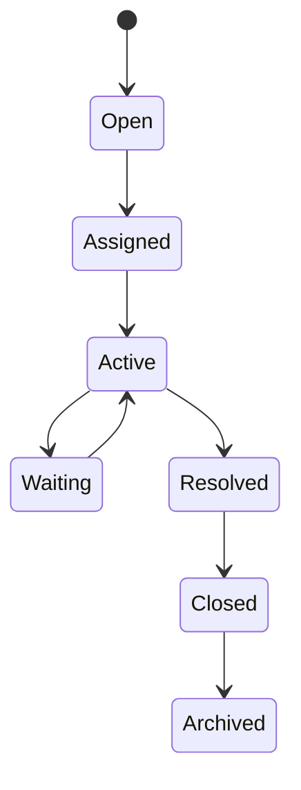

# Conversation

> *"A conversation is the continuous exchange of messages, events, and context between participants across one or more communication channels."*

---

## Document Information

| Field | Value |
|---|---|
| Term | Conversation |
| Category | CRM / Communication / AI |
| Status | Official |
| Owner | Clara Core Team |
| Last Updated | 2026-07-06 |

---

# Definition

A **Conversation** is a persistent communication thread that groups related interactions between participants over time.

A Conversation may include messages exchanged between:

- Customer and human agent
- Customer and AI Agent
- Human agent and AI Agent
- Internal collaborators
- External systems through integrations

A Conversation is the primary unit of communication within Clara.

---

# Purpose

Conversations exist to:

- Preserve communication history.
- Maintain business context.
- Coordinate collaboration.
- Support omnichannel messaging.
- Enable AI-assisted interactions.
- Improve customer experience.
- Provide auditable communication records.

---

# Participants

A Conversation may include:

- Customer
- User
- AI Agent
- Team
- External Integration
- Bot or Service Account

Each participant should have a clearly defined identity.

---

# Relationship to Customer

A Customer may have multiple Conversations.

```text
Customer
├── Conversation A
├── Conversation B
└── Conversation C
```

Conversation history contributes to customer context.

---

# Relationship to Channels

A Conversation may span multiple channels.

Examples:

- WhatsApp
- Instagram
- TikTok
- Telegram
- Email
- Live Chat
- Facebook Messenger
- Voice
- SMS

Clara should unify these channels into a single logical Conversation when appropriate.

---

# Conversation Lifecycle



---

# Conversation Components

A Conversation may contain:

- Messages
- Attachments
- Reactions
- Internal notes
- AI summaries
- Tags
- Assignments
- Events
- Audit history
- Workflow references

---

# AI Integration

AI may assist Conversations by:

- Summarizing history.
- Detecting intent.
- Classifying sentiment.
- Suggesting replies.
- Extracting structured data.
- Recommending next actions.
- Escalating low-confidence situations.

AI recommendations should remain reviewable and auditable.

---

# Security Considerations

Conversation data may contain sensitive information.

Clara must enforce:

- Authentication
- Authorization
- Organization isolation
- Workspace isolation
- Data minimization
- Audit logging
- Encryption in transit
- Encryption at rest

Access should always be evaluated server-side.

---

# Privacy Considerations

Conversation history may include:

- Personal information
- Business information
- Attachments
- Media
- AI-generated summaries

Retention and deletion policies must comply with organizational and regulatory requirements.

---

# Observability

Track:

- Conversation created
- Message received
- Message sent
- Assignment changes
- AI recommendation generated
- Status transitions
- Resolution time
- First response time

---

# Common Examples

Examples include:

- Customer support chat
- Sales inquiry
- WhatsApp conversation
- Instagram DM thread
- Email support thread
- Internal escalation discussion

---

# Anti-Patterns

Avoid:

- Splitting one logical interaction into unnecessary conversations.
- Mixing unrelated customers in the same conversation.
- Deleting conversation history without policy.
- Allowing AI to access unauthorized conversations.
- Losing channel correlation.

---

# Preferred Usage

Use:

```text
Conversation
```

Avoid using these interchangeably:

```text
Chat
Thread
Session
Message Log
```

These may represent related concepts but are not equivalent.

---

# Related Terms

- Customer
- User
- AI Agent
- Message
- Ticket
- Workflow
- Context
- Channel

---

# References

- Book II — Master Blueprint
- Book V — AI Bible
- CRM Domain Specification
- docs/standards/GLOSSARY-STANDARD.md
