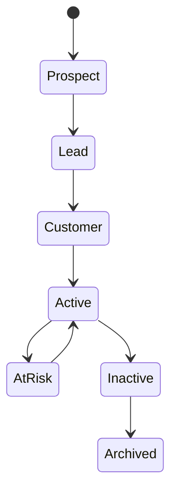

# Customer

> *"A customer is the business relationship Athena exists to understand, support, and strengthen."*

---

## Document Information

| Field | Value |
|---|---|
| Term | Customer |
| Category | CRM / Business |
| Status | Official |
| Owner | Athena Core Team |
| Last Updated | 2026-07-06 |

---

# Definition

A **Customer** is a person, company, organization, or external entity that has a business relationship with an Organization using Athena.

A Customer may represent:

- An existing buyer.
- A prospective buyer.
- A client.
- A subscriber.
- A patient.
- A student.
- A partner.
- A citizen.
- A service recipient.

The exact business meaning may vary by industry, but within Athena, Customer represents the primary external relationship managed by the platform.

---

# Purpose

Customers exist in Athena to provide a central business entity for:

- CRM.
- Sales.
- Marketing.
- Customer support.
- Communication.
- Billing.
- Analytics.
- AI personalization.
- Workflow automation.
- Organizational memory.

A Customer should serve as a unified point of context across business domains.

---

# Relationship to Organization

Customers belong to an Organization.

```text
Organization
└── Customer
```

Customer data must never be shared across Organizations unless explicitly supported by a secure and governed architecture.

---

# Relationship to Workspace

Customers may be visible to one or more Workspaces depending on access rules and business configuration.

Examples:

```text
Organization
├── Sales Workspace
│   └── Customer
└── Support Workspace
    └── Customer
```

Workspace-level visibility must be controlled by authorization rules.

---

# Relationship to Conversation

A Customer may have many Conversations.

```text
Customer
├── Conversation A
├── Conversation B
└── Conversation C
```

Conversation history contributes to customer context, support history, sales understanding, and AI-assisted recommendations.

---

# Relationship to Lead

A Lead may become a Customer when a business relationship is established.

```text
Lead
  ↓ conversion
Customer
```

A Lead represents potential.

A Customer represents an established relationship.

---

# Relationship to Ticket

A Customer may have many Tickets.

```text
Customer
├── Ticket A
├── Ticket B
└── Ticket C
```

Tickets represent support issues, service requests, incidents, or operational problems related to the Customer.

---

# Customer Profile

A Customer profile may include:

- Name.
- Contact information.
- Organization or company name.
- Customer type.
- Status.
- Tags.
- Owner.
- Segment.
- Source.
- Communication history.
- Purchase history.
- Support history.
- Preferences.
- Custom attributes.

The exact schema should be defined in the CRM Domain and Database Specification.

---

# Customer Lifecycle



Lifecycle stages may vary by business domain.

---

# Customer Context

Customer context may include:

- Conversations.
- Tickets.
- Orders.
- Invoices.
- Tasks.
- Notes.
- Workflows.
- AI summaries.
- Preferences.
- Historical decisions.

This context should be available only to authorized users and AI capabilities.

---

# AI Usage

AI may assist with Customers by:

- Summarizing customer history.
- Detecting intent.
- Recommending next actions.
- Drafting replies.
- Predicting churn risk.
- Classifying customer segment.
- Extracting structured information from conversations.
- Suggesting workflow automation.

AI access to Customer data must follow authorization and privacy rules.

---

# Security Considerations

Customer data is business-sensitive.

Athena must enforce:

- Authentication.
- Authorization.
- Organization isolation.
- Workspace isolation.
- Least privilege.
- Audit logging.
- Data classification.
- Secure export controls.
- Access review for sensitive records.

Client-side filtering must never be treated as sufficient authorization.

---

# Privacy Considerations

Customer records may contain personal data.

Examples:

- Name.
- Email.
- Phone number.
- Address.
- Communication history.
- Payment-related metadata.
- Attachments.
- Sensitive notes.

Customer data must follow privacy, retention, export, and deletion requirements.

---

# Auditability

Important Customer actions should be auditable.

Examples:

- Customer created.
- Customer updated.
- Customer merged.
- Customer deleted.
- Customer exported.
- Customer assigned.
- Customer status changed.
- AI summary generated.
- Sensitive field viewed.

---

# Data Ownership

Customer data is typically owned by the CRM or Customer Domain.

Other Domains may reference, cache, or project Customer data, but the source of truth must remain clear.

No other Domain should modify Customer-owned data without an authorized contract.

---

# Common Examples

Examples of Customers:

- A buyer in an ecommerce company.
- A client of a consulting business.
- A patient of a clinic.
- A student in an education platform.
- A citizen using a government service.
- A subscriber of a SaaS product.

---

# Anti-Patterns

Avoid:

- Mixing Lead and Customer without lifecycle clarity.
- Duplicating Customer records across Workspaces without governance.
- Allowing AI to access unrestricted Customer data.
- Storing sensitive Customer data in free-text notes without controls.
- Treating external platform contact IDs as the only Customer identity.
- Exporting Customer data without auditability.

---

# Preferred Usage

Use:

```text
Customer
```

Avoid using these as direct replacements:

```text
Client
Contact
Account
Buyer
User
Lead
```

These may be valid in specific domains, but official Athena CRM documentation should use `Customer` for the central external business relationship.

---

# Related Terms

- Organization
- Workspace
- Lead
- Conversation
- Ticket
- Contact
- CRM
- Workflow
- AI Agent
- Context
- Audit Log

---

# References

- Book II — Master Blueprint
- CRM Domain Specification
- Customer Support Domain Specification
- docs/standards/GLOSSARY-STANDARD.md
- docs/standards/SECURITY-DOCS-STANDARD.md
