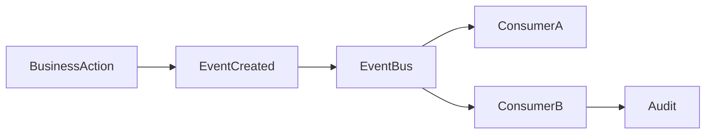

# Event

> *"An event records that something meaningful has already happened."*

---

## Document Information

| Field | Value |
|---|---|
| Term | Event |
| Category | Architecture / Integration |
| Status | Official |
| Owner | Clara Core Team |
| Last Updated | 2026-07-06 |

---

# Definition

An **Event** is an immutable record describing something that has already occurred within Clara.

Events communicate business facts between Domains and Services without requiring direct runtime coupling.

Events describe the past. They are not commands or requests.

---

# Purpose

Events exist to:

- Decouple Services.
- Notify other Domains of business changes.
- Trigger asynchronous workflows.
- Improve scalability.
- Enable auditability.
- Support analytics and AI pipelines.

---

# Event Characteristics

Every Event should be:

- Immutable.
- Timestamped.
- Versioned.
- Traceable.
- Idempotent when processed.
- Owned by exactly one publishing Domain.

---

# Relationship to Domain

A Domain publishes Events about facts it owns.

```text
Customer Domain
    │
    └── CustomerCreated
```

Only the owning Domain should publish events representing its business entities.

---

# Relationship to Service

Services publish and consume Events.

```text
Service A
    │ publishes
    ▼
Event Bus
    ▲
    │ consumes
Service B
```

Consumers should depend on the event contract, not the publisher implementation.

---

# Event Structure

Recommended metadata:

```text
event_id
event_name
event_version
occurred_at
publisher
correlation_id
causation_id
organization_id
workspace_id
payload
```

Business payload should remain separate from transport metadata.

---

# Naming Convention

Use the format:

```text
<Entity><PastTenseVerb>
```

Examples:

```text
CustomerCreated
CustomerUpdated
ConversationAssigned
TicketClosed
WorkflowStarted
WorkflowCompleted
KnowledgeIndexed
AIResponseGenerated
PluginInstalled
```

Avoid imperative names such as:

```text
CreateCustomer
RunWorkflow
SendMessage
```

Those represent commands, not events.

---

# Event Lifecycle



---

# Delivery Semantics

Document:

- Delivery guarantees.
- Ordering expectations.
- Retry behavior.
- Dead-letter handling.
- Replay strategy.

Consumers should be idempotent whenever possible.

---

# Versioning

Events are contracts.

Breaking changes require a new event version.

Preferred approach:

```text
CustomerCreated.v1
CustomerCreated.v2
```

Avoid changing payload semantics without version updates.

---

# Security Considerations

Events may contain sensitive data.

Consider:

- Data minimization.
- Authorization boundaries.
- Encryption in transit.
- Tenant/workspace isolation.
- Sensitive field masking.
- Audit logging.

Do not publish secrets or credentials in event payloads.

---

# Observability

Each Event should support:

- Correlation IDs.
- Distributed tracing.
- Publisher metrics.
- Consumer metrics.
- Retry metrics.
- Failure metrics.

---

# Anti-Patterns

Avoid:

- Chatty events with little value.
- Publishing events before a transaction is committed.
- Mutable event payloads.
- Multiple Domains publishing the same business event.
- Events that behave like RPC calls.

---

# Preferred Usage

Use:

```text
Event
```

Avoid confusing Events with:

```text
Command
Request
Notification
Webhook
```

These concepts have different responsibilities.

---

# Related Terms

- Domain
- Service
- Event Bus
- Workflow
- Command
- Integration
- Audit Log
- Correlation ID

---

# References

- Book I — Architecture Principles
- Book II — Master Blueprint
- Book III — Event-Driven Architecture
- docs/standards/GLOSSARY-STANDARD.md
- docs/standards/NAMING-CONVENTION.md
