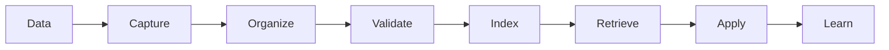

# Knowledge

> *"Knowledge is connected information that can be understood, reused, and trusted."*

---

## Document Information

| Field | Value |
|---|---|
| Term | Knowledge |
| Category | AI / Data / Business |
| Status | Official |
| Owner | Clara Core Team |
| Last Updated | 2026-07-06 |

---

# Definition

**Knowledge** is information that has been organized, connected, contextualized, and made useful for people, workflows, services, and AI capabilities.

Knowledge is more than raw data.

Raw data records facts.

Knowledge explains meaning, relationships, and usage.

---

# Purpose

Knowledge exists to help Clara:

- Preserve organizational memory.
- Improve AI responses.
- Support decision-making.
- Reduce repeated explanations.
- Make information reusable.
- Connect business context across domains.
- Help teams learn continuously.

---

# Relationship to Data

Data becomes Knowledge when it gains context and structure.

```text
Data
  ↓
Context
  ↓
Knowledge
  ↓
Intelligence
```

Example:

```text
Data: "Customer sent 5 messages."
Knowledge: "Customer has an unresolved support issue related to billing."
```

---

# Relationship to Context

Knowledge is a source of Context.

Context is the selected subset of Knowledge used for a specific interaction or task.

```text
Knowledge Base
      ↓ retrieval
Context
      ↓
AI Response / Workflow Decision
```

---

# Relationship to Memory

Memory preserves information over time.

Knowledge is the organized understanding that can be retrieved from that memory.

```text
Memory stores.
Knowledge explains.
Context applies.
```

---

# Forms of Knowledge

Clara Knowledge may include:

- Documentation.
- Policies.
- FAQs.
- Customer history.
- Support resolutions.
- Product information.
- Operational procedures.
- Meeting decisions.
- Workflow definitions.
- AI evaluation results.
- Business rules.
- Lessons learned.

---

# Knowledge Sources

Common sources include:

- Documents.
- Conversations.
- Tickets.
- Events.
- Audit logs.
- Databases.
- Integrations.
- Runbooks.
- ADRs.
- PRDs and TDDs.
- Human-authored notes.
- AI-generated summaries reviewed by humans.

---

# Knowledge Lifecycle



---

# Knowledge Quality

Useful Knowledge should be:

- Accurate.
- Current.
- Traceable.
- Authorized.
- Searchable.
- Explainable.
- Versioned where needed.
- Linked to source material.
- Reviewed when business-critical.

---

# Knowledge Base

A **Knowledge Base** is a structured repository of reusable Knowledge.

It may support:

- Search.
- Retrieval-Augmented Generation (RAG).
- Customer support.
- Internal operations.
- AI assistants.
- Workflow automation.
- Onboarding.
- Decision support.

---

# Security Considerations

Knowledge may contain sensitive information.

Access to Knowledge must respect:

- Organization boundaries.
- Workspace boundaries.
- Role and Permission rules.
- Data classification.
- Privacy requirements.
- Auditability.

AI systems must only retrieve Knowledge the requesting identity is authorized to access.

---

# Privacy Considerations

Knowledge derived from customer data, personal data, or internal communications must follow privacy and retention requirements.

Do not expose personal or restricted information unnecessarily in AI context.

---

# Auditability

Knowledge changes should be auditable when they affect business-critical decisions.

Audit events may include:

- Knowledge article created.
- Knowledge article updated.
- Knowledge indexed.
- Knowledge deprecated.
- Knowledge retrieved by AI.
- Knowledge used in recommendation.

---

# Anti-Patterns

Avoid:

- Treating unverified AI output as trusted Knowledge.
- Storing outdated information without lifecycle status.
- Mixing private and public Knowledge without access controls.
- Duplicating conflicting Knowledge across systems.
- Losing source references.
- Allowing AI to retrieve unrestricted Knowledge.

---

# Common Examples

Examples of Knowledge in Clara:

- A support solution for a recurring issue.
- A company refund policy.
- A product limitation explanation.
- A workflow approval rule.
- An ADR explaining why a technology was chosen.
- A runbook for incident recovery.
- A customer interaction summary approved by a human.

---

# Preferred Usage

Use:

```text
Knowledge
```

Avoid using it interchangeably with:

```text
Data
Information
Memory
Context
Prompt
```

These are related but distinct concepts.

---

# Related Terms

- Data
- Context
- Memory
- AI Agent
- Knowledge Base
- RAG
- Search Index
- Workflow
- Document

---

# References

- Book I — Data Philosophy
- Book I — AI Philosophy
- Book V — AI Bible
- docs/standards/GLOSSARY-STANDARD.md
- docs/standards/AI-DOCUMENTATION-STANDARD.md
