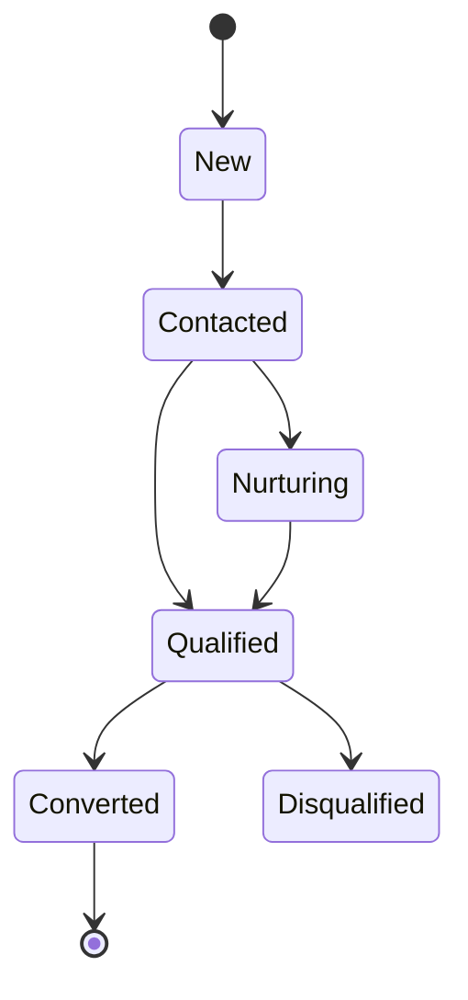

# Lead

> *"A lead represents potential business value before a qualified customer relationship exists."*

---

## Document Information

| Field | Value |
|---|---|
| Term | Lead |
| Category | CRM / Sales |
| Status | Official |
| Owner | Clara Core Team |
| Last Updated | 2026-07-06 |

---

# Definition

A **Lead** is a person, organization, or opportunity that has shown interest in a product or service but has not yet become an established Customer.

A Lead represents a potential business relationship that requires qualification.

---

# Purpose

Leads exist to help organizations:

- Capture opportunities.
- Track acquisition channels.
- Qualify prospects.
- Prioritize follow-up.
- Measure marketing effectiveness.
- Support sales forecasting.
- Automate nurturing workflows.

---

# Relationship to Customer

A qualified Lead may be converted into a Customer.

```text
Visitor
   ↓
Lead
   ↓ Qualification
Opportunity (optional)
   ↓ Conversion
Customer
```

Not every Lead becomes a Customer.

---

# Relationship to Conversation

A Lead may participate in one or more Conversations.

Conversation history helps determine:

- Intent
- Buying readiness
- Pain points
- Qualification status

---

# Relationship to Workflow

Typical Lead workflows include:

- Lead capture
- Lead enrichment
- Qualification
- Assignment
- Nurturing
- Conversion
- Disqualification

---

# Lead Sources

Examples:

- Website form
- WhatsApp
- Instagram
- TikTok
- Email
- Phone
- Referral
- Advertising campaign
- Manual import
- API integration

Source attribution should be preserved for analytics.

---

# Lead Profile

Typical attributes:

- Name
- Contact information
- Company
- Source
- Campaign
- Owner
- Status
- Score
- Tags
- Notes
- Interests
- Last activity

The CRM domain defines the authoritative schema.

---

# Lead Lifecycle



Lifecycle names may vary by organization.

---

# Qualification

Qualification may consider:

- Budget
- Authority
- Need
- Timeline
- Engagement level
- Product fit
- AI-assisted scoring

Qualification rules should remain configurable.

---

# AI Usage

AI may assist by:

- Lead scoring
- Intent detection
- Conversation summarization
- Data extraction
- Next-best-action recommendations
- Follow-up drafting

AI recommendations should support—not replace—business decisions.

---

# Security Considerations

Lead information is business-sensitive.

Clara should enforce:

- Authentication
- Authorization
- Workspace isolation
- Organization isolation
- Audit logging
- Least privilege
- Controlled export

---

# Privacy Considerations

Lead data may contain personal information.

Retention, deletion, consent, and processing must follow organizational policy and applicable regulations.

---

# Auditability

Audit events should include:

- Lead created
- Lead updated
- Lead assigned
- Lead qualified
- Lead converted
- Lead exported
- Lead deleted

---

# Anti-Patterns

Avoid:

- Treating every contact as a Lead.
- Converting Leads without qualification.
- Duplicating Leads across Workspaces.
- Losing source attribution.
- Mixing Lead and Customer identifiers.

---

# Preferred Usage

Use:

```text
Lead
```

Avoid replacing it with:

```text
Prospect
Contact
Potential Customer
Inquiry
```

These may describe related concepts but should not replace the official term in Clara.

---

# Related Terms

- Customer
- Conversation
- Workflow
- Opportunity
- Campaign
- Organization
- Workspace
- AI Agent

---

# References

- Book II — Master Blueprint
- CRM Domain Specification
- Sales Domain Specification
- docs/standards/GLOSSARY-STANDARD.md
