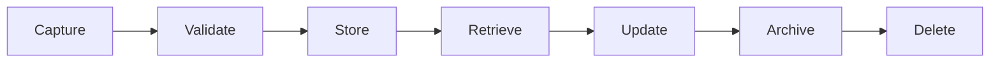

# Memory

> *"Memory preserves what should be remembered so future decisions become more accurate."*

---

## Document Information

| Field | Value |
|---|---|
| Term | Memory |
| Category | AI / Architecture |
| Status | Official |
| Owner | Clara Core Team |
| Last Updated | 2026-07-06 |

---

# Definition

**Memory** is the capability that allows Clara to retain information across time and reuse it in future interactions, workflows, and decisions.

Unlike Context, Memory persists beyond a single request.

Memory may belong to a user, organization, workspace, AI agent, workflow, or system.

---

# Purpose

Memory exists to:

- Preserve continuity.
- Personalize AI behavior.
- Reduce repeated questions.
- Improve decision quality.
- Support long-running workflows.
- Build organizational intelligence.

---

# Relationship to Context

Memory is **not** Context.

```text
Memory
    ↓ Retrieve
Relevant Facts
    ↓
Context Builder
    ↓
Context
    ↓
AI Execution
```

Memory stores information.

Context uses only the information required for the current task.

---

# Relationship to Knowledge

Knowledge is structured understanding.

Memory is long-term retained information.

```text
Experience
    ↓
Memory
    ↓
Knowledge
    ↓
Context
```

Not every Memory becomes Knowledge.

---

# Memory Types

## Session Memory

Exists only during the current session.

Examples:

- Temporary variables
- Current workflow state
- Conversation state

---

## Conversation Memory

Persists across conversations with the same identity.

Examples:

- Preferred language
- Communication style
- Common requests

---

## Organizational Memory

Shared knowledge belonging to an Organization.

Examples:

- Internal procedures
- Business terminology
- Approved workflows
- Historical decisions

---

## Agent Memory

Private memory owned by an AI Agent.

Examples:

- Intermediate reasoning state
- Tool execution history
- Planning artifacts
- Cached observations

---

# Memory Lifecycle



Memory should have defined retention and deletion policies.

---

# Memory Principles

Good Memory should be:

- Relevant
- Authorized
- Versioned
- Auditable
- Secure
- Explainable
- Minimal
- Current

---

# Retrieval

Memory retrieval should consider:

- Identity
- Organization
- Workspace
- Authorization
- Recency
- Confidence
- Relevance

Avoid retrieving unrelated memories.

---

# Security Considerations

Memory may contain sensitive information.

Clara must enforce:

- Authentication
- Authorization
- Tenant isolation
- Workspace isolation
- Encryption
- Audit logging
- Least privilege
- Data minimization

Memory must never bypass access controls.

---

# Privacy Considerations

Memory may contain:

- Personal preferences
- Conversation history
- Customer information
- Organizational knowledge

Retention, deletion, and access policies must comply with organizational and regulatory requirements.

---

# Observability

Track:

- Memory creation
- Memory retrieval
- Memory updates
- Retrieval latency
- Retrieval source
- Memory usage
- Retrieval failures

---

# Anti-Patterns

Avoid:

- Remembering everything.
- Permanent storage without lifecycle rules.
- Retrieving unauthorized memories.
- Mixing memories across organizations.
- Treating memory as immutable.
- Hidden memory sources.

---

# Common Examples

Examples of Memory:

- Preferred reply language.
- Customer communication preferences.
- Previously approved workflow.
- Frequently used integrations.
- AI planning history.
- Organization-specific terminology.

---

# Preferred Usage

Use:

```text
Memory
```

Do not use interchangeably with:

```text
Context
Knowledge
Cache
History
State
```

Each represents a different architectural concept.

---

# Related Terms

- Context
- Knowledge
- AI Agent
- Retrieval
- Conversation
- Workflow
- Organization
- User

---

# References

- Book V — AI Bible
- AI Specification Template
- docs/standards/AI-DOCUMENTATION-STANDARD.md
- docs/standards/GLOSSARY-STANDARD.md
