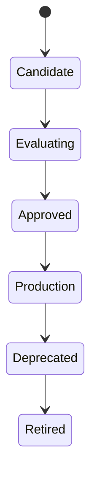

# Model

> *"A Model performs inference. An AI Agent decides when and how to use it."*

---

## Document Information

| Field | Value |
|---|---|
| Term | Model |
| Category | AI / Machine Learning |
| Status | Official |
| Owner | Athena Core Team |
| Last Updated | 2026-07-06 |

---

# Definition

A **Model** is a computational component that performs inference on input data to produce an output.

Within Athena, a Model is responsible for prediction, generation, classification, ranking, embedding, or other AI capabilities.

A Model does not own business logic, workflows, permissions, or orchestration.

Those responsibilities belong to higher-level components such as AI Agents and Services.

---

# Purpose

Models exist to:

- Generate text.
- Classify content.
- Extract structured information.
- Produce embeddings.
- Rank search results.
- Analyze images or documents.
- Support AI-assisted decision making.

---

# Relationship to AI Agent

An AI Agent orchestrates work.

A Model performs inference.

```text
User Request
      ↓
AI Agent
      ↓
Context Builder
      ↓
AI Model
      ↓
Inference Result
      ↓
AI Agent
      ↓
Tool / Workflow / Response
```

A single Agent may use multiple Models.

---

# Model Types

## Large Language Model (LLM)

Generates and understands natural language.

Examples:

- Conversation
- Summarization
- Translation
- Reasoning

---

## Embedding Model

Converts content into vector representations.

Common uses:

- Semantic search
- Retrieval
- Similarity matching

---

## Reranking Model

Ranks retrieved information based on relevance.

---

## Classification Model

Assigns categories or labels.

Examples:

- Intent detection
- Spam detection
- Sentiment analysis

---

## Vision Model

Processes images or visual documents.

Examples:

- OCR
- Image understanding
- Object detection

---

## Speech Model

Processes spoken language.

Examples:

- Speech-to-text
- Text-to-speech

---

# Model Selection

Athena should select Models based on:

- Capability
- Latency
- Accuracy
- Cost
- Security
- Availability
- Regulatory requirements

Avoid coupling architecture to a single provider.

---

# Model Lifecycle



---

# Inputs

Typical model inputs include:

- Prompt
- Context
- Retrieved Knowledge
- Images
- Documents
- Structured data

Inputs must be validated and authorized.

---

# Outputs

Typical outputs include:

- Generated text
- Structured JSON
- Classification labels
- Embeddings
- Confidence scores
- Recommendations

Outputs should be validated before use in critical workflows.

---

# Security Considerations

Models should operate within Athena's security boundaries.

Consider:

- Prompt injection resistance
- Sensitive data handling
- Output validation
- Provider trust
- Tenant isolation
- Data minimization
- Audit logging

Never expose secrets or unrestricted internal data to a Model.

---

# Evaluation

Models should be evaluated continuously.

Suggested metrics:

- Accuracy
- Precision / Recall
- Latency
- Cost
- Hallucination rate
- Safety compliance
- User satisfaction

---

# Observability

Capture:

- Model version
- Provider
- Inference latency
- Token usage
- Error rate
- Cost
- Confidence score
- Correlation ID

---

# Anti-Patterns

Avoid:

- Treating the Model as an AI Agent.
- Embedding business logic inside prompts.
- Using one Model for every task.
- Ignoring output validation.
- Locking the platform to one provider.
- Bypassing authorization when building prompts.

---

# Preferred Usage

Use:

```text
Model
```

Do not use interchangeably with:

```text
AI Agent
Assistant
Bot
Workflow
Service
```

A Model is an inference engine, not an application.

---

# Related Terms

- AI Agent
- Context
- Memory
- Knowledge
- Prompt
- Embedding
- RAG
- Tool Calling
- Workflow

---

# References

- Book V — AI Bible
- AI Specification Template
- docs/standards/AI-DOCUMENTATION-STANDARD.md
- docs/standards/GLOSSARY-STANDARD.md
