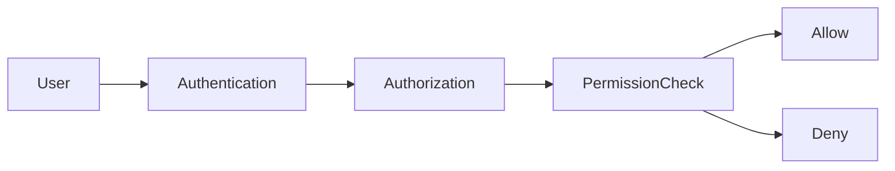

# Permission

> *"Permissions define exactly what an identity is allowed to do."*

---

## Document Information

| Field | Value |
|---|---|
| Term | Permission |
| Category | Identity / Security / Authorization |
| Status | Official |
| Owner | Athena Core Team |
| Last Updated | 2026-07-06 |

---

# Definition

A **Permission** is the smallest unit of authorization in Athena.

It represents a specific action that an authenticated identity is allowed to perform on a protected resource.

Permissions are evaluated during authorization and should never be assumed based solely on UI visibility or client-side logic.

---

# Purpose

Permissions exist to:

- Enforce least privilege.
- Protect sensitive resources.
- Enable fine-grained authorization.
- Support delegated administration.
- Improve auditability.
- Reduce security risk.

---

# Relationship to Roles

Permissions are typically granted through one or more Roles.

```text
User
└── Role
    └── Permission
```

A Role groups permissions.

A Permission authorizes an action.

---

# Permission Model

Athena recommends the format:

```text
<resource>:<action>
```

Examples:

```text
customer:read
customer:create
customer:update
customer:delete

conversation:read
conversation:reply

ticket:update

workflow:execute

user:invite

role:manage
```

This format keeps permissions predictable and easy to search.

---

# Authorization Flow



Authorization should evaluate:

- Identity
- Organization
- Workspace
- Role assignments
- Explicit grants
- Policies
- Resource ownership

---

# Scope

Permissions may apply at different scopes:

- Organization
- Workspace
- Team
- Resource
- System

A permission granted in one scope must not automatically apply to another scope.

---

# Categories

Common permission groups include:

## Identity

- user:read
- user:update
- role:manage
- permission:view

## Customer

- customer:create
- customer:read
- customer:update
- customer:delete

## Conversation

- conversation:read
- conversation:reply
- conversation:assign

## Workflow

- workflow:create
- workflow:update
- workflow:execute

## Administration

- settings:update
- integration:manage
- billing:manage

---

# Security Considerations

Permissions are security-critical.

Rules:

- Validate every request server-side.
- Never trust client claims.
- Deny by default.
- Log authorization failures.
- Review privileged permissions regularly.

---

# Auditability

Audit events should be recorded for:

- Permission granted
- Permission revoked
- Authorization denied
- Privileged permission usage
- Policy changes

Each audit event should include:

- Actor
- Resource
- Permission
- Scope
- Timestamp
- Result

---

# Anti-Patterns

Avoid:

- Wildcard permissions for normal users.
- Hard-coded permission checks.
- Client-side authorization only.
- Permissions without documentation.
- Hidden privileged permissions.

---

# Preferred Usage

Use:

```text
Permission
```

Avoid:

```text
Access Flag
Capability
Privilege
```

unless documenting a distinct concept.

---

# Related Terms

- User
- Role
- Authorization
- Authentication
- Policy
- Organization
- Workspace
- Audit Log
- Least Privilege

---

# References

- Book I — Security Philosophy
- Book II — Organization Layer
- docs/standards/GLOSSARY-STANDARD.md
- docs/standards/SECURITY-DOCS-STANDARD.md
