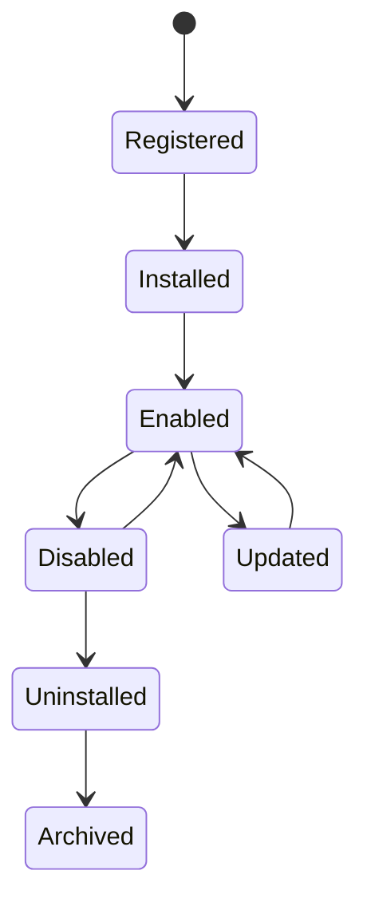

# Plugin

> *"A plugin extends Clara through governed contracts without changing the core platform."*

---

## Document Information

| Field | Value |
|---|---|
| Term | Plugin |
| Category | Platform / Ecosystem / Integration |
| Status | Official |
| Owner | Clara Core Team |
| Last Updated | 2026-07-06 |

---

# Definition

A **Plugin** is an installable extension that adds, modifies, or integrates platform capabilities through approved Clara extension points.

Plugins allow Clara to grow as an ecosystem while preserving core platform stability, security, and governance.

A Plugin should operate through documented contracts rather than direct access to internal implementation details.

---

# Purpose

Plugins exist to:

- Extend Clara capabilities.
- Integrate external systems.
- Add domain-specific features.
- Support ecosystem development.
- Enable third-party innovation.
- Preserve core platform stability.
- Avoid modifying Clara core for every new capability.

---

# Relationship to Extension Points

A Plugin connects to one or more approved Extension Points.

Examples:

- UI extension point
- Workflow action
- AI tool
- Integration connector
- Event subscriber
- Notification provider
- Data import/export provider
- Authentication provider

Extension Points define what a Plugin is allowed to do.

---

# Relationship to Integration

An Integration connects Clara to an external system.

A Plugin may provide one or more Integrations.

```text
Plugin
├── Connector
├── Webhook Handler
├── OAuth Configuration
└── Workflow Actions
```

Not every Integration is a Plugin, but many integrations may be packaged as Plugins.

---

# Relationship to Service

Plugins should not bypass Services.

They should interact through approved APIs, events, SDKs, or extension contracts.

```text
Plugin
  ↓
Plugin SDK / API Contract
  ↓
Clara Service
```

Direct database access should not be allowed.

---

# Plugin Capabilities

A Plugin may provide:

- UI components
- Workflow steps
- Automation actions
- AI tools
- External connectors
- Webhook handlers
- Import/export actions
- Notification channels
- Domain-specific fields
- Reporting extensions

---

# Plugin Lifecycle



---

# Security Considerations

Plugins are security-sensitive because they may access platform data or execute actions.

Clara must enforce:

- Plugin authentication.
- Plugin authorization.
- Permission scopes.
- Tenant/workspace isolation.
- Secret isolation.
- Input validation.
- Output safety.
- Audit logging.
- Rate limiting.
- Version compatibility checks.

Plugins must never receive unrestricted access by default.

---

# Permission Model

Plugins should request explicit permissions.

Examples:

```text
customer:read
conversation:read
workflow:execute
notification:send
ai-tool:invoke
```

Users or administrators should understand what access a Plugin requires before enabling it.

---

# Data Access

Plugins should access data through approved APIs.

They should not:

- Query databases directly.
- Bypass authorization checks.
- Read unrelated workspace data.
- Store sensitive data without policy.
- Exfiltrate data to unapproved destinations.

---

# Auditability

Important Plugin actions should create audit events.

Examples:

- Plugin installed.
- Plugin enabled.
- Plugin disabled.
- Plugin updated.
- Plugin uninstalled.
- Permission granted.
- Plugin action executed.
- Plugin webhook processed.
- Plugin error occurred.

---

# Version Compatibility

Plugins should declare compatibility with Clara versions.

Example:

```text
compatible_with: ">=1.0.0 <2.0.0"
```

Breaking changes to extension contracts require clear migration guidance.

---

# Observability

Plugins should expose:

- Execution logs.
- Error metrics.
- Latency metrics.
- Retry counts.
- Webhook failures.
- API usage.
- Permission failures.

---

# AI Plugin Considerations

A Plugin may expose AI tools or AI capabilities.

AI Plugins must document:

- Tool purpose.
- Required permissions.
- Input schema.
- Output schema.
- Side effects.
- Human approval requirements.
- Prompt injection risks.
- Audit requirements.

---

# Common Examples

Examples of Plugins:

- WhatsApp Connector.
- Instagram DM Connector.
- TikTok DM Connector.
- Payment Gateway Connector.
- Slack Notification Plugin.
- CRM Import Plugin.
- AI Summarization Tool.
- Custom Workflow Action.
- Analytics Export Plugin.

---

# Anti-Patterns

Avoid:

- Plugins with unrestricted access.
- Plugins that bypass Clara APIs.
- Plugins that store secrets insecurely.
- Plugins that execute destructive actions without approval.
- Plugins that depend on undocumented internals.
- Plugins without version compatibility.
- Plugins without audit logs.

---

# Preferred Usage

Use:

```text
Plugin
```

Avoid using interchangeably with:

```text
Extension
Connector
Adapter
Integration
App
```

These may be related concepts, but Plugin is the official term for installable capability extensions.

---

# Related Terms

- Integration
- Connector
- Adapter
- Extension Point
- Service
- API
- Event
- Workflow
- AI Agent
- Permission
- Audit Log

---

# References

- Book II — Master Blueprint
- Book VIII — Ecosystem
- Plugin SDK Specification
- Integration Specification Template
- docs/standards/GLOSSARY-STANDARD.md
- docs/standards/SECURITY-DOCS-STANDARD.md
