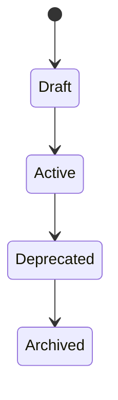

# Role

> *"A role groups responsibilities so access can be managed consistently and safely."*

---

## Document Information

| Field | Value |
|---|---|
| Term | Role |
| Category | Identity / Security / Platform |
| Status | Official |
| Owner | Athena Core Team |
| Last Updated | 2026-07-06 |

---

# Definition

A **Role** is a named collection of responsibilities and permissions assigned to a User, Service Account, or AI Agent within a specific scope.

Roles help Athena manage access consistently without assigning every permission manually to every identity.

A Role describes what an identity is expected to do.

Permissions describe what an identity is allowed to do.

---

# Purpose

Roles exist to:

- Simplify access management.
- Group related permissions.
- Represent business responsibilities.
- Support least privilege.
- Improve auditability.
- Enable consistent authorization.
- Reduce permission management errors.

Roles should make access understandable to humans while still mapping to precise permissions internally.

---

# Relationship to User

A User may have one or more Roles.

```text
User
└── Role
    └── Permissions
```

A User may have different Roles in different Workspaces.

Example:

```text
User: Arya
├── Sales Workspace → Sales Manager
└── Support Workspace → Viewer
```

---

# Relationship to Permission

A Role grants one or more Permissions.

Example:

```text
Role: Support Agent
├── customer:read
├── conversation:read
├── conversation:reply
└── ticket:update
```

Roles should not be treated as the final authorization decision by themselves.

Authorization should evaluate the effective permissions derived from assigned roles, policies, and scope.

---

# Scope

Roles should be scoped.

Common scopes include:

- Organization-level Role.
- Workspace-level Role.
- Team-level Role.
- Resource-level Role.
- System-level Role.

A Role assigned in one scope should not automatically grant access in another scope unless explicitly designed and documented.

---

# Common Role Examples

Common Athena Roles may include:

- Owner
- Admin
- Workspace Admin
- Manager
- Agent
- Analyst
- Developer
- Billing Admin
- Security Reviewer
- Viewer

These examples are not final product requirements. Actual roles should be defined by the Identity and Authorization architecture.

---

# System Roles vs Custom Roles

Athena may support two types of Roles.

## System Role

A predefined Role created by Athena.

Examples:

- Owner
- Admin
- Viewer

System Roles provide safe defaults.

## Custom Role

A Role created by an Organization or Workspace administrator.

Custom Roles allow organizations to define access based on their own operational needs.

Custom Roles must still follow platform authorization rules.

---

# Security Considerations

Roles are security-sensitive.

Role assignment must be:

- Authenticated.
- Authorized.
- Audited.
- Scoped.
- Reviewed regularly.

High-privilege Roles should require additional safeguards such as:

- Multi-factor authentication.
- Approval workflow.
- Temporary elevation.
- Audit monitoring.
- Least privilege review.

---

# Least Privilege

Roles should grant only the permissions required for the responsibility they represent.

Avoid broad Roles unless necessary.

Bad example:

```text
Support Agent → Full Workspace Admin
```

Better example:

```text
Support Agent
├── customer:read
├── conversation:read
├── conversation:reply
└── ticket:update
```

---

# Role Lifecycle

A Role may move through lifecycle states.



Typical states:

- Draft
- Active
- Deprecated
- Archived

Deprecated Roles should include replacement guidance.

---

# Auditability

Important Role actions should create audit events.

Examples:

- Role created.
- Role updated.
- Role deleted.
- Role assigned.
- Role removed.
- Permission added to Role.
- Permission removed from Role.

Audit logs should include:

- Actor.
- Target identity.
- Role.
- Scope.
- Timestamp.
- Action.
- Result.

---

# Anti-Patterns

Avoid:

- Roles with unclear responsibility.
- Roles named after individuals.
- Roles that grant excessive access.
- Roles that mix unrelated responsibilities.
- Roles that bypass permission checks.
- Global admin Roles used for daily work.
- Hidden permissions inside poorly documented Roles.

---

# Preferred Usage

Use:

```text
Role
```

Avoid using these as direct replacements:

```text
User Type
Group
Level
Access Class
Position
```

These may describe related concepts, but official Athena authorization documentation should use `Role`.

---

# Related Terms

- User
- Permission
- Policy
- Authorization
- Authentication
- Workspace
- Organization
- Audit Log
- Least Privilege
- Service Account
- AI Agent

---

# References

- Book I — Security Philosophy
- Book II — Organization Layer
- docs/standards/GLOSSARY-STANDARD.md
- docs/standards/SECURITY-DOCS-STANDARD.md
- docs/standards/NAMING-CONVENTION.md
