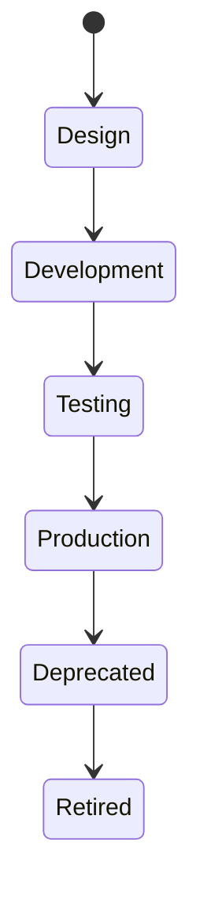

# Service

> *"A service implements one or more business capabilities behind a well-defined contract."*

---

## Document Information

| Field | Value |
|---|---|
| Term | Service |
| Category | Architecture / Platform |
| Status | Official |
| Owner | Athena Core Team |
| Last Updated | 2026-07-06 |

---

# Definition

A **Service** is an independently deployable software component that exposes a clear contract and is responsible for implementing one or more capabilities within a Domain.

A Service encapsulates business logic, owns its operational behavior, and communicates with other Services through explicit interfaces.

---

# Purpose

Services exist to:

- Implement business capabilities.
- Encapsulate business logic.
- Reduce coupling.
- Improve scalability.
- Enable independent deployment.
- Support observability and resilience.
- Provide reusable platform capabilities.

---

# Relationship to Domain

A Service belongs to a Domain.

```text
Domain
├── Service A
├── Service B
└── Service C
```

A Domain may contain multiple Services.

A Service should avoid implementing responsibilities from unrelated Domains.

---

# Responsibilities

A Service may be responsible for:

- Business logic.
- Data validation.
- Data ownership.
- API endpoints.
- Event publishing.
- Event consumption.
- Background processing.
- Integration orchestration.
- Audit generation.

---

# Communication

Services communicate through explicit contracts such as:

- REST APIs
- GraphQL
- gRPC
- Events
- Message Queues
- Scheduled Jobs

Avoid direct database access across Services.

---

# Data Ownership

Every Service should clearly define:

- Entities it owns.
- Source of truth.
- Read models.
- Cached data.
- Published events.

No two Services should claim ownership of the same business entity.

---

# Service Boundaries

A Service should define:

- Public interfaces.
- Internal implementation.
- Dependencies.
- Failure behavior.
- Security requirements.
- Operational ownership.

---

# Service Lifecycle



---

# Security Considerations

Every Service should implement:

- Authentication.
- Authorization.
- Input validation.
- Output encoding.
- Audit logging.
- Secret management.
- Rate limiting (where applicable).
- Tenant/workspace isolation.

Trust no caller without verification.

---

# Observability

Every Service should emit:

- Structured logs.
- Metrics.
- Distributed traces.
- Health checks.
- Audit events.

Operational health should be measurable.

---

# Failure Handling

Document expected behavior for:

- Dependency failure.
- Timeout.
- Invalid input.
- Retry exhaustion.
- Partial failure.
- Provider outage.

Services should fail gracefully whenever possible.

---

# Anti-Patterns

Avoid:

- God Services.
- Shared databases as integration.
- Hidden APIs.
- Circular dependencies.
- Cross-domain business logic.
- Tight runtime coupling.

---

# Preferred Usage

Use:

```text
Service
```

Avoid replacing it with:

```text
Module
Component
Microservice
Backend
```

Those terms describe related concepts but are not equivalent.

---

# Related Terms

- Domain
- API
- Event
- Workflow
- Entity
- Data Ownership
- Integration
- Source of Truth

---

# References

- Book I — Architecture Principles
- Book II — Master Blueprint
- Book III — Architecture
- docs/standards/GLOSSARY-STANDARD.md
- docs/standards/NAMING-CONVENTION.md
