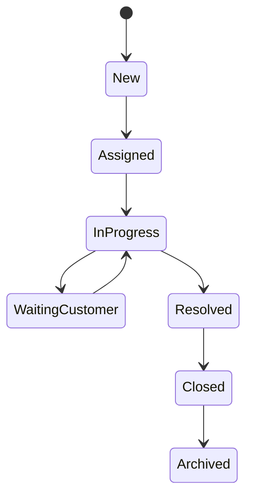

# Ticket

> *"A ticket represents a trackable unit of work created to resolve a customer issue, request, or operational task."*

---

## Document Information

| Field | Value |
|---|---|
| Term | Ticket |
| Category | Customer Support / Operations |
| Status | Official |
| Owner | Clara Core Team |
| Last Updated | 2026-07-06 |

---

# Definition

A **Ticket** is a managed work item that records, tracks, prioritizes, assigns, and resolves an issue, request, incident, or task.

A Ticket provides accountability, visibility, and a structured lifecycle from creation to resolution.

---

# Purpose

Tickets exist to:

- Track customer issues.
- Coordinate work across teams.
- Enforce SLA commitments.
- Measure operational performance.
- Trigger workflows and automation.
- Build reusable organizational knowledge.

---

# Relationship to Customer

A Customer may own multiple Tickets.

```text
Customer
├── Ticket #1001
├── Ticket #1002
└── Ticket #1003
```

Every Ticket should be traceable to the originating Customer or business entity.

---

# Relationship to Conversation

A Ticket may reference one or more Conversations.

```text
Conversation
      ↓
Ticket
      ↓
Resolution
```

Conversation history provides context for investigation and resolution.

---

# Relationship to Workflow

Tickets frequently trigger Workflows:

- Auto assignment
- Priority calculation
- Escalation
- Approval
- Notification
- Resolution
- Satisfaction survey

---

# Ticket Attributes

Typical fields include:

- Ticket ID
- Title
- Description
- Status
- Priority
- Severity
- Category
- Assignee
- Reporter
- Customer
- SLA
- Due Date
- Tags
- Attachments
- Related Conversations

The authoritative schema belongs to the Customer Support Domain.

---

# Ticket Lifecycle



Lifecycle customization should preserve auditability.

---

# Priority & Severity

Priority defines **business urgency**.

Severity defines **business impact**.

Both should be configurable and documented separately.

---

# SLA Management

A Ticket may define:

- First response target
- Resolution target
- Escalation rules
- Business hours
- Pause conditions

SLA events should be observable and auditable.

---

# AI Usage

AI may assist by:

- Classifying tickets.
- Suggesting categories.
- Predicting priority.
- Summarizing conversations.
- Recommending knowledge articles.
- Drafting responses.
- Detecting duplicate tickets.
- Suggesting routing.

Human review should remain available for business-critical actions.

---

# Security Considerations

Ticket data may contain sensitive business and personal information.

Clara should enforce:

- Authentication
- Authorization
- Organization isolation
- Workspace isolation
- Least privilege
- Audit logging
- Controlled exports

---

# Privacy Considerations

Tickets may contain:

- Personal information
- Attachments
- Internal notes
- Customer communications
- AI-generated summaries

Retention and deletion must follow organizational policy.

---

# Auditability

Audit events should include:

- Ticket created
- Ticket assigned
- Status changed
- Priority changed
- SLA breached
- Comment added
- AI recommendation accepted/rejected
- Ticket resolved
- Ticket closed

---

# Analytics

Typical KPIs include:

- First Response Time (FRT)
- Resolution Time
- Reopen Rate
- SLA Compliance
- Customer Satisfaction (CSAT)
- Ticket Volume
- Agent Productivity

---

# Anti-Patterns

Avoid:

- Tickets without owners.
- Closing tickets without resolution.
- Bypassing SLA monitoring.
- Mixing unrelated issues into one ticket.
- Deleting historical ticket records without governance.

---

# Preferred Usage

Use:

```text
Ticket
```

Avoid replacing it with:

```text
Case
Issue
Request
Task
Incident
```

These may map to specialized ticket types but should not replace the core platform concept.

---

# Related Terms

- Customer
- Conversation
- Workflow
- Knowledge
- AI Agent
- SLA
- User
- Organization
- Workspace

---

# References

- Book II — Master Blueprint
- Customer Support Domain Specification
- Operations Domain Specification
- docs/standards/GLOSSARY-STANDARD.md
- docs/standards/SECURITY-DOCS-STANDARD.md
