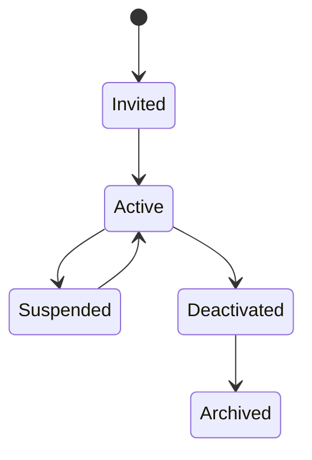

# User

> *"A user is a human identity that interacts with Athena under defined permissions and accountability."*

---

## Document Information

| Field | Value |
|---|---|
| Term | User |
| Category | Identity / Platform |
| Status | Official |
| Owner | Athena Core Team |
| Last Updated | 2026-07-06 |

---

# Definition

A **User** is a human identity that can access Athena.

A User belongs to one or more Organizations and may participate in one or more Workspaces depending on membership, role assignment, and permission rules.

A User represents a real person, not an automated system.

Automated identities should be documented separately as **Service Accounts**, **API Clients**, or **AI Agents**.

---

# Purpose

Users exist to provide accountable human access to Athena.

A User may:

- Log in to Athena.
- Access Workspaces.
- Manage business data.
- Participate in workflows.
- Communicate with customers.
- Configure modules.
- Review AI recommendations.
- Approve sensitive actions.
- Trigger automation.
- Perform administrative tasks.

Every User action should be attributable for audit and governance purposes.

---

# Relationship to Organization

A User may be associated with one or more Organizations.

```text
User
├── Organization A
└── Organization B
```

However, access to one Organization does not imply access to another Organization.

Every Organization membership must be explicitly defined.

---

# Relationship to Workspace

A User may belong to one or more Workspaces within an Organization.

```text
Organization
└── Workspace
    └── User
```

Workspace access should always be validated server-side.

A User may have different roles in different Workspaces.

Example:

```text
User: Arya
├── Sales Workspace → Manager
└── Support Workspace → Viewer
```

---

# Relationship to Role

A User may be assigned one or more Roles.

A Role is a named set of responsibilities or permissions.

Example:

```text
User
└── Role
    └── Permissions
```

Role assignment should follow the principle of least privilege.

---

# Relationship to Permission

A User does not automatically receive permissions.

Permissions are granted through:

- Roles.
- Policies.
- Workspace membership.
- Organization membership.
- Explicit grants.
- Temporary elevation.

Authorization should evaluate the effective permissions of a User before allowing access.

---

# User Types

Athena may support several user categories.

## Internal User

A person working inside the Organization.

Examples:

- Admin
- Manager
- Support Agent
- Sales Representative
- Analyst

## External User

A person with limited access to specific Athena capabilities.

Examples:

- Customer portal user
- Partner user
- Contractor
- Guest collaborator

## Platform Admin

A highly privileged User responsible for managing platform-level operations.

Platform Admin access must be tightly controlled and audited.

---

# Security Considerations

User identity is security-sensitive.

Athena should enforce:

- Authentication.
- Authorization.
- Multi-factor authentication where required.
- Session management.
- Least privilege.
- Audit logging.
- Account lifecycle management.
- Secure password or identity provider integration.
- Account lockout or abuse protection.

User identity should never be trusted solely from the client.

---

# Account Lifecycle

A User may move through lifecycle states.



Typical states:

- Invited
- Active
- Suspended
- Deactivated
- Archived

User lifecycle changes should be auditable.

---

# Auditability

Important User actions should create audit events.

Examples:

- User invited.
- User activated.
- User role changed.
- User permission changed.
- User suspended.
- User logged in.
- User failed authentication.
- User approved sensitive action.

Audit logs should include:

- Actor.
- Target user.
- Organization.
- Workspace.
- Timestamp.
- Action.
- Result.

---

# Privacy Considerations

User records may contain personal data.

Examples:

- Name.
- Email.
- Phone number.
- Profile image.
- Authentication metadata.
- Activity history.
- IP address.
- Device metadata.

User data should follow privacy, retention, and access control requirements.

---

# Data Ownership

User identity data may be owned by the Identity domain or Identity Service.

Workspace-specific membership data may be owned by the Workspace or Access Control domain depending on architecture.

Ownership must be clearly documented in architecture and database specifications.

---

# Common Examples

Examples of Users:

- Organization owner.
- Workspace admin.
- Support agent.
- Sales manager.
- Billing admin.
- Security reviewer.
- AI workflow approver.
- Read-only analyst.

---

# Preferred Usage

Use:

```text
User
```

Avoid using these as direct replacements:

```text
Member
Person
Account
Operator
Staff
Human
```

These terms may appear in product-specific contexts, but official platform documentation should use `User`.

---

# Related Terms

- Organization
- Workspace
- Role
- Permission
- Authentication
- Authorization
- Service Account
- AI Agent
- Audit Log
- Policy

---

# References

- Book I — Security Philosophy
- Book II — Organization Layer
- docs/standards/GLOSSARY-STANDARD.md
- docs/standards/SECURITY-DOCS-STANDARD.md
