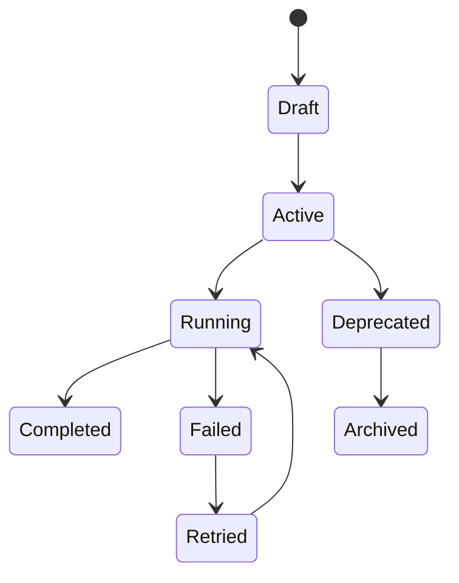
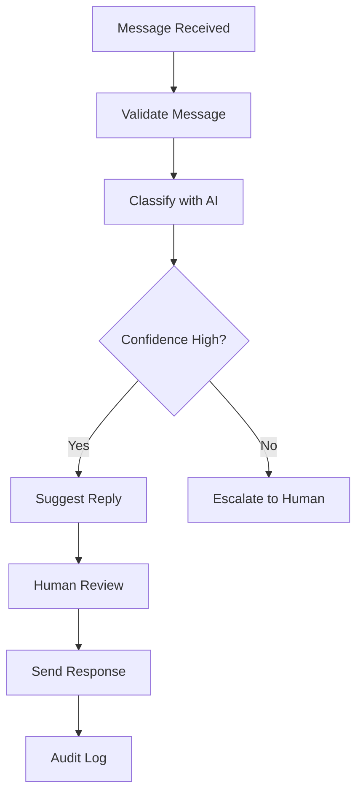

# Workflow

> *"A workflow turns business intent into a repeatable sequence of actions."*

---

## Document Information

| Field | Value |
|---|---|
| Term | Workflow |
| Category | Business / Automation / Architecture |
| Status | Official |
| Owner | Athena Core Team |
| Last Updated | 2026-07-06 |

---

# Definition

A **Workflow** is a structured sequence of steps that moves work from one state to another.

A Workflow may involve humans, Athena services, AI agents, automation rules, external integrations, approvals, events, and scheduled tasks.

Workflows represent how business processes are executed inside Athena.

---

# Purpose

Workflows exist to:

- Standardize business processes.
- Reduce repetitive work.
- Coordinate humans and systems.
- Connect multiple Domains and Services.
- Enable automation.
- Preserve process history.
- Improve visibility and accountability.

---

# Workflow Characteristics

A good Workflow should be:

- Clear.
- Observable.
- Auditable.
- Configurable.
- Recoverable.
- Secure.
- Versioned where necessary.
- Understandable by business users and engineers.

---

# Relationship to Event

Events often trigger Workflows.

```text
Event
  ↓
Workflow Trigger
  ↓
Workflow Execution
```

Examples:

```text
CustomerCreated → Start onboarding workflow
TicketClosed → Send satisfaction survey
MessageReceived → Run AI classification workflow
```

---

# Relationship to Automation

Automation executes predefined steps within a Workflow.

A Workflow may contain automated and manual steps.

Example:

```text
Workflow
├── Validate input
├── Assign owner
├── Generate AI summary
├── Request human approval
└── Send notification
```

Automation should not remove accountability.

---

# Relationship to AI

AI may assist inside Workflows by:

- Classifying inputs.
- Summarizing conversations.
- Recommending next actions.
- Drafting replies.
- Extracting structured data.
- Calling tools.
- Escalating low-confidence cases.

AI-assisted Workflow steps should remain auditable and bounded by authorization.

---

# Workflow Lifecycle



---

# Workflow Components

Common Workflow components include:

- Trigger
- Condition
- Step
- Action
- Approval
- Assignment
- Timer
- Event
- Notification
- Error handler
- Escalation
- Completion state

---

# Workflow Example



---

# Security Considerations

Workflows are security-sensitive because they may perform actions across multiple systems.

Every Workflow should consider:

- Who can create the Workflow.
- Who can edit the Workflow.
- Who can execute the Workflow.
- Which permissions each step requires.
- Whether AI is allowed to act.
- Whether human approval is required.
- Which actions must be audited.
- How tenant and workspace isolation are enforced.

---

# Auditability

Workflow execution should be traceable.

Audit records may include:

- Workflow started.
- Step executed.
- Step failed.
- Approval requested.
- Approval granted.
- Approval denied.
- AI recommendation generated.
- External action executed.
- Workflow completed.
- Workflow failed.

---

# Failure Handling

Workflows should define behavior for:

- Step failure.
- Timeout.
- Dependency outage.
- Invalid input.
- Permission failure.
- AI low-confidence result.
- External provider failure.

Failure handling may include:

- Retry.
- Manual intervention.
- Escalation.
- Compensation action.
- Cancellation.
- Rollback where possible.

---

# Versioning

Workflow definitions may require versioning.

When a Workflow changes, Athena should preserve the version used by existing executions.

This prevents historical execution records from becoming ambiguous.

---

# Common Examples

Examples of Workflows:

- Lead qualification.
- Customer onboarding.
- Ticket escalation.
- AI reply review.
- Invoice approval.
- Document approval.
- Integration sync.
- Incident response.
- Employee onboarding.
- Knowledge article review.

---

# Anti-Patterns

Avoid:

- Workflows without owners.
- Workflows that bypass authorization.
- AI steps without auditability.
- Long-running workflows without recovery.
- Hidden side effects.
- Unversioned workflow definitions.
- Workflows that are impossible to debug.

---

# Preferred Usage

Use:

```text
Workflow
```

Avoid using these as direct replacements:

```text
Process
Flow
Automation
Pipeline
Task Chain
```

These may be related concepts, but official Athena documentation should use `Workflow` for structured business execution.

---

# Related Terms

- Event
- Automation
- AI Agent
- Service
- Domain
- Task
- Approval
- Audit Log
- Scheduler
- Queue

---

# References

- Book I — Product Principles
- Book I — Engineering Philosophy
- Book II — Master Blueprint
- Book III — Architecture
- docs/standards/GLOSSARY-STANDARD.md
- docs/standards/AI-DOCUMENTATION-STANDARD.md
