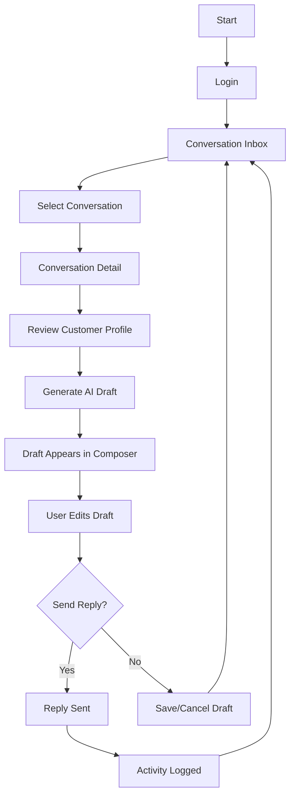

# 04 — User Journeys and UX Flows

> *"The MVP user journey should be simple enough to demo and strict enough to trust."*

---

# Primary Journey

## Journey: Reply to Customer with AI Assistance

```text
1. User logs in.
2. User opens conversation inbox.
3. User selects a conversation.
4. User reviews message history.
5. User reviews customer profile sidebar.
6. User clicks Generate AI Draft.
7. System generates draft.
8. User reviews and edits draft.
9. User sends reply.
10. System records activity.
```

---

# Flow Diagram



---

# Empty State Flow

```text
Inbox empty:
"Belum ada conversation. Import demo data atau hubungkan channel pertama."

Conversation has no customer profile:
"Customer profile belum lengkap. Tambahkan detail customer untuk meningkatkan kualitas reply."

AI draft unavailable:
"AI draft belum tersedia. Kamu tetap bisa menulis reply manual."
```

---

# Error State Flow

## AI Draft Error

```text
User clicks Generate AI Draft.
AI provider fails.
System shows safe error.
User can write manual reply.
System logs safe error without secrets.
```

## Send Error

```text
User clicks Send.
Send fails.
System keeps draft in composer.
System shows retry-safe error.
Activity records failure status.
```

---

# UX Principles

The UI should make clear:

```text
AI is assisting, not deciding
draft is editable
send is user-controlled
customer context is visible
errors are recoverable
sensitive data is not overexposed
```

---

# Required Screens

```text
Login / authenticated state
Conversation Inbox
Conversation Detail
Customer Profile Sidebar
Reply Composer
AI Draft Loading/Error State
Activity Log/Timeline
```

---

# UX Rule

```text
The user should never wonder whether AI has already sent something.
```
