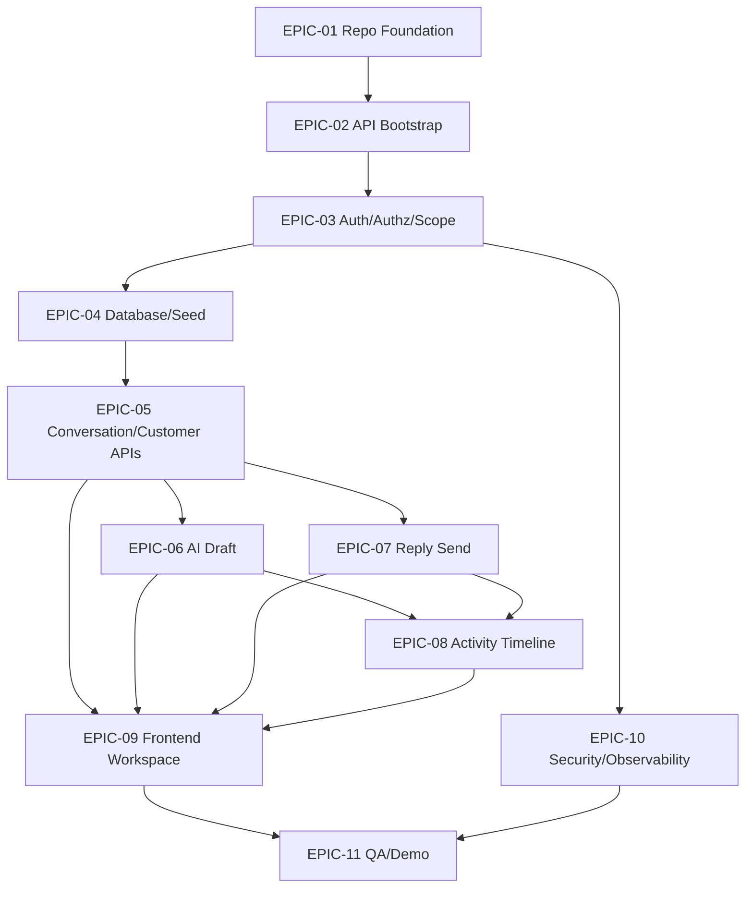

# 02 — Epic Map

> *"Epics keep implementation organized around outcomes, not random tasks."*

---

# Epic Overview

| Epic | Name | Goal | Priority |
|---|---|---|---|
| EPIC-01 | Repository and Implementation Foundation | Prepare repo for implementation | P0 |
| EPIC-02 | API Bootstrap and Platform Baseline | Start API safely | P0 |
| EPIC-03 | Auth/Authz/Tenant Scope | Protect data and actions | P0 |
| EPIC-04 | Database Migration and Seed Data | Persist MVP workflow | P0 |
| EPIC-05 | Conversation and Customer APIs | Power inbox/detail/sidebar | P0 |
| EPIC-06 | AI Draft Generation | Generate safe editable reply draft | P0 |
| EPIC-07 | Reply Send / Simulated Send | Send human-reviewed reply | P0 |
| EPIC-08 | Activity Timeline | Trace AI/reply actions | P0 |
| EPIC-09 | Frontend Conversation Workspace | Build main MVP UI | P0 |
| EPIC-10 | Security, Privacy, Observability | Harden and validate | P0 |
| EPIC-11 | Testing, QA, Demo Validation | Prove MVP readiness | P0 |

---

# Epic Dependency Map



---

# Epic Acceptance Criteria

## EPIC-01

Accepted when:

```text
repo skeleton exists
root docs/governance exists
AGENTS/SECURITY/CONTRIBUTING present
CI docs check exists
```

## EPIC-02

Accepted when:

```text
API starts locally
health endpoint works
config validation works
safe error handler exists
correlation id exists
```

## EPIC-03

Accepted when:

```text
mock/dev auth works
roles owner/agent/viewer resolved
permission helpers exist
workspace scope helper exists
negative tests pass
```

## EPIC-04

Accepted when:

```text
migrations run
seed data exists
constraints/indexes exist
cross-workspace fixture exists
```

## EPIC-05

Accepted when:

```text
conversation list/detail/customer profile APIs work
workspace scoping enforced
contract tests pass
```

## EPIC-06

Accepted when:

```text
AI draft works with mock provider
context minimized
draft is editable
no outbound message created
```

## EPIC-07

Accepted when:

```text
human-reviewed reply can be simulated sent
viewer blocked
activity event recorded
draft preserved on failure
```

## EPIC-08

Accepted when:

```text
AI and reply events appear in timeline
metadata safe
workspace scoped
```

## EPIC-09

Accepted when:

```text
three-panel UI works
AI draft UX works
viewer UX works
safe states exist
```

## EPIC-10

Accepted when:

```text
security checklist P0 passes
logs safe
errors safe
negative tests pass
```

## EPIC-11

Accepted when:

```text
manual QA passes
demo validation passes
release gate documented
```
