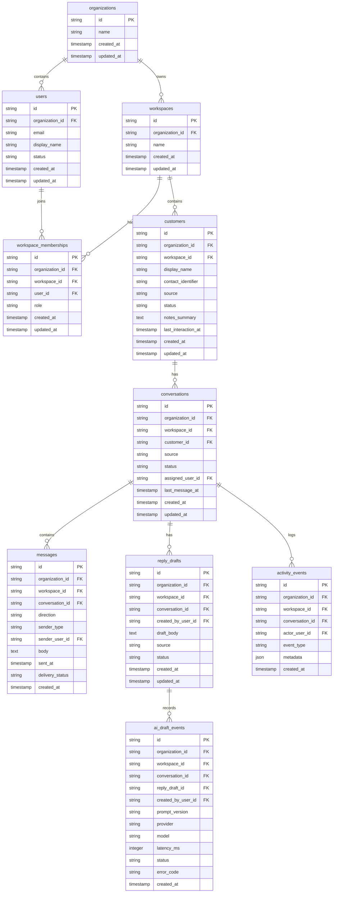

# 02 — Entity Relationship Model

> *"The ERD should make product behavior and data ownership obvious."*

---

# Purpose

This document defines the MVP entity relationship model.

---

# Entity Relationship Diagram



---

# Relationship Notes

## Organization -> Workspace

One organization can have multiple workspaces.

For MVP, one organization and one workspace may be enough for demo seed data.

---

## Workspace -> Customer

Customers belong to one workspace.

Do not share customers across workspaces in MVP.

---

## Customer -> Conversation

A customer can have multiple conversations.

---

## Conversation -> Message

A conversation has many messages.

---

## Conversation -> ReplyDraft

A conversation can have multiple drafts.

For MVP, keeping draft history is useful for traceability.

---

## ReplyDraft -> AIDraftEvent

AI draft event references the created draft.

If AI fails and no draft is created, `reply_draft_id` may be nullable.

---

## Conversation -> ActivityEvent

Activity timeline is conversation-scoped.

---

# ERD Rule

```text
Every child business entity should preserve organization_id and workspace_id for direct scoping and safer queries.
```
