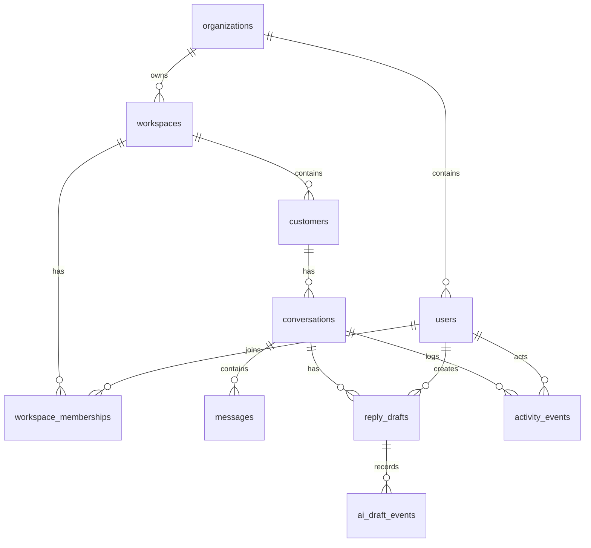

# CLARA MVP First Product Slice Database Migration Spec

## Unified Customer Conversation Inbox Persistence Model

---

# 1. Database Summary

This migration spec defines the persistence layer for the MVP conversation workflow:

```text
workspace
users and roles
customers
conversations
messages
AI reply drafts
AI draft metadata/events
conversation activity timeline
```

---

# 2. Primary Database Goal

The database must support:

```text
conversation inbox
conversation detail
customer profile sidebar
AI-assisted draft generation
human-reviewed reply send/simulated send
activity timeline
authorization and tenant scoping
demo seed data
```

---

# 3. Recommended Database

Use a relational database.

Recommended default:

```text
PostgreSQL
```

Why:

```text
strong constraints
transaction support
good indexing
JSONB support for controlled metadata
good migration tooling support
works well for tenant-scoped SaaS MVP
```

---

# 4. Core Tables

```text
organizations
workspaces
users
workspace_memberships
customers
conversations
messages
reply_drafts
ai_draft_events
activity_events
```

---

# 5. Entity Relationship Diagram



---

# 6. Tenant Scope Rule

These tables must include both:

```text
organization_id
workspace_id
```

```text
customers
conversations
messages
reply_drafts
ai_draft_events
activity_events
```

The backend must query them with both fields.

---

# 7. MVP Enum Values

```text
workspace_member_role:
  owner
  agent
  viewer

customer_status:
  new
  active
  archived
  blocked

conversation_status:
  open
  pending
  closed

conversation_source:
  demo
  whatsapp_demo
  web_chat_demo

message_direction:
  inbound
  outbound
  internal

sender_type:
  customer
  agent
  system

message_delivery_status:
  received
  sent
  simulated
  failed

reply_draft_source:
  manual
  ai

reply_draft_status:
  draft
  sent
  discarded

ai_draft_status:
  succeeded
  failed

activity_event_type:
  ai_draft_generated
  ai_draft_failed
  reply_sent
  reply_failed
  conversation_status_changed
```

---

# 8. Migration Strategy

Use incremental migrations:

```text
001_create_core_workspace_identity_tables
002_create_customer_conversation_message_tables
003_create_reply_draft_and_ai_draft_event_tables
004_create_activity_event_tables
005_create_indexes
006_seed_demo_data_optional
```

Seed data should be optional and safe for local/demo only.

---

# 9. Rollback Strategy

Rollback should be safe in dev/staging.

For production-like environments:

```text
avoid destructive rollback when data exists
prefer forward-fix migration
backup before destructive migration
```

---

# 10. Security Design

Database must support:

```text
tenant isolation
role mapping
activity traceability
AI draft traceability
safe metadata storage
no secret storage
privacy-conscious data minimization
```

---

# 11. Acceptance Criteria

This Database Migration Spec is accepted when:

```text
all MVP API data needs are supported
tenant/workspace scoping is explicit
tables and columns are defined
constraints and indexes are defined
AI draft events are traceable
activity timeline is supported
seed data is safe
rollback strategy is defined
security and privacy rules are clear
SQL starter skeleton exists
```
