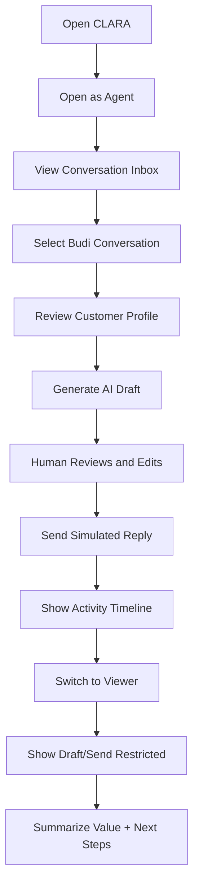

# CLARA MVP First Product Slice Demo Script

## Unified Customer Conversation Inbox Demo

---

# 1. Demo Objective

Show that CLARA MVP can help a team:

```text
see customer conversations
understand customer context
generate an AI-assisted reply draft
review and edit before sending
send/simulate the final reply
record activity
enforce viewer restrictions
recover safely when AI/send fails
```

---

# 2. Demo Duration

Recommended:

```text
10–15 minutes
```

Extended version:

```text
20–30 minutes including Q&A, failure scenarios, and security discussion
```

---

# 3. Demo Story

```text
A customer named Budi asks whether a product is still available. The agent opens CLARA, reads the conversation, checks the customer profile, generates an AI-assisted reply draft, edits the draft, sends a simulated reply, and confirms the activity timeline. Then we switch to Viewer mode to prove that view-only users cannot draft or send.
```

---

# 4. Demo Flow Summary



---

# 5. Demo Success Criteria

Demo succeeds when:

```text
agent completes reply workflow end-to-end
AI draft is clearly editable and not auto-sent
activity timeline updates
viewer cannot generate AI draft
viewer cannot send reply
demo uses fake data only
security boundaries are explained clearly
next implementation step is obvious
```

---

# 6. Closing Message

```text
This MVP proves the core CLARA loop: customer conversation, customer context, AI-assisted drafting, human review, safe send, and traceable activity. The next step is to move from documentation into repository skeleton and implementation PRs.
```
