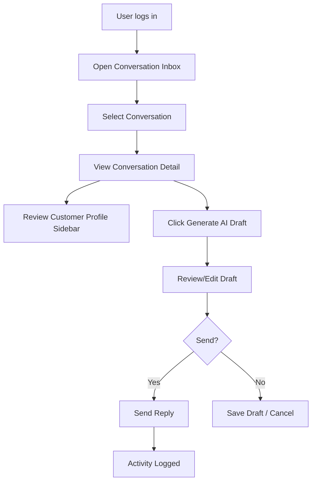

# CLARA MVP First Product Slice PRD

## Product Requirements Document

---

# 1. Product Name

```text
CLARA MVP — Unified Customer Conversation Inbox
```

---

# 2. One-Line Summary

CLARA MVP allows an authenticated team member to view customer conversations, inspect customer context, generate an AI-assisted reply draft, edit it, and send or save it only after human review.

---

# 3. Product Problem

Small teams often manage customer conversations across scattered tools, browser tabs, social channels, notes, and manual follow-ups.

This creates several problems:

```text
customer context is fragmented
reply quality is inconsistent
support/sales agents waste time rewriting similar replies
important conversation history is hard to find
handoff between team members is weak
AI usage is unsafe if replies are sent without review
customer data can leak if access control is weak
```

---

# 4. Product Goal

The goal of this MVP is to prove that CLARA can become the trusted workspace for customer conversation handling.

The MVP should help a user:

```text
see conversations in one inbox
open a conversation
see customer profile/context
generate an AI reply draft
edit the draft
send the reply manually
record the reply/activity
```

---

# 5. MVP Slice

The MVP slice contains four core surfaces:

```text
1. Login / authenticated access
2. Conversation Inbox
3. Conversation Detail + Reply Composer
4. Customer Profile Sidebar
```

The MVP also contains one AI capability:

```text
AI-assisted reply draft generation
```

Human review is mandatory.

---

# 6. Target Users

## Primary User

```text
Sales/support operator
```

Responsibilities:

```text
respond to customer conversations
review customer context
use AI draft to save time
edit reply before sending
escalate if needed
```

## Secondary User

```text
Team lead / owner
```

Responsibilities:

```text
review customer handling quality
monitor team response process
manage team access in future version
```

## Future Users

```text
admin
superadmin
growth operator
customer success manager
automation manager
```

These are mostly out of MVP scope except where role rules are needed for future safety.

---

# 7. User Value Proposition

For a sales/support operator:

```text
CLARA helps me respond faster because I can see customer context and use AI draft suggestions without losing human control.
```

For a team owner:

```text
CLARA helps my team create more consistent customer replies while preserving oversight and security.
```

---

# 8. MVP Scope

## In Scope

```text
authenticated dashboard access
conversation list
conversation detail
customer profile sidebar
reply composer
AI draft reply generation
human edit/review before send
manual send action
basic conversation status
basic activity log
basic role-based access
basic audit event for AI draft/send
safe error handling
```

## Out of Scope

```text
full omnichannel integration
real-time multi-provider sync
campaign automation
billing/monetization
advanced workflow automation
AI autonomous sending
AI agent actions
full CRM pipeline
mobile app
multi-language AI tuning
advanced analytics dashboard
full admin role management
```

---

# 9. Core User Flow



---

# 10. Product Requirements Summary

| ID | Requirement | Priority |
|---|---|---|
| PRD-001 | User can access authenticated CLARA dashboard | P0 |
| PRD-002 | User can see conversation inbox | P0 |
| PRD-003 | User can filter basic conversation status | P1 |
| PRD-004 | User can open conversation detail | P0 |
| PRD-005 | User can see customer profile/context | P0 |
| PRD-006 | User can generate AI reply draft | P0 |
| PRD-007 | User can edit AI draft before send | P0 |
| PRD-008 | AI draft cannot be sent automatically | P0 |
| PRD-009 | User can send final reply manually | P0 |
| PRD-010 | Activity/audit event is recorded | P0 |
| PRD-011 | User only sees authorized conversations | P0 |
| PRD-012 | System avoids exposing secrets/sensitive internals | P0 |
| PRD-013 | Error states are safe and understandable | P1 |
| PRD-014 | MVP can run in local/dev environment | P0 |
| PRD-015 | MVP supports future channel adapters | P1 |

---

# 11. Success Metrics

MVP success should be measured by:

```text
time to first response draft
AI draft acceptance/edit rate
manual reply completion rate
conversation open-to-reply conversion
operator-perceived usefulness
security/privacy issue count
critical bug count
```

---

# 12. Key Product Decisions

## Decision 1 — Human Review Required

AI may draft replies, but it must not send replies automatically in MVP.

Reason:

```text
reduces customer trust risk
reduces hallucination risk
keeps human accountable
simpler security and compliance posture
```

## Decision 2 — Start with One Primary Inbox

Do not build full omnichannel routing in MVP.

Reason:

```text
lower integration complexity
faster validation
easier UX
lower privacy/security risk
```

## Decision 3 — Customer Profile Sidebar is Required

The profile sidebar is not optional because AI reply quality and human decision quality both depend on context.

Reason:

```text
prevents generic replies
helps user understand customer state
builds CRM foundation
```

---

# 13. Main Risks

```text
AI draft may be inaccurate or hallucinated
customer data may be overexposed
authorization may be too weak
conversation source integration may become complex
reply send behavior may need provider-specific handling
users may over-trust AI
MVP scope may expand too much
```

---

# 14. Risk Mitigations

```text
human review before send
server-side authorization
tenant/workspace scoping
audit events
safe logging
limited MVP scope
AI prompt/version tracking
privacy-safe data context
clear UI label for AI-generated draft
```

---

# 15. Launch Criteria

MVP can be considered ready for internal demo when:

```text
user can login
conversation inbox loads
conversation detail loads
customer profile is visible
AI draft can be generated
draft can be edited
final reply can be sent or simulated
activity is logged
unauthorized access is blocked
basic tests pass
no secrets are exposed
```

---

# 16. Next Documents

This PRD should be followed by:

```text
1. TDD
2. UX Flow + UI Spec
3. API Spec
4. Database Migration Spec
5. Security & Privacy Checklist
6. Test Plan
7. Backlog / Task Breakdown
8. README / Runbook
9. Demo Script
```
