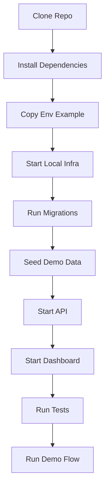

# CLARA MVP First Product Slice README / Runbook

## Unified Customer Conversation Inbox Operational Guide

---

# 1. MVP Overview

This MVP provides one focused workflow:

```text
Authenticated user opens CLARA
User views customer conversation inbox
User opens conversation detail
User reviews customer profile
Agent/Owner generates AI reply draft
Human reviews and edits draft
Human manually sends/simulates reply
Activity timeline records important events
Viewer can view but cannot draft/send
```

---

# 2. Local Development Goal

A developer should be able to:

```text
clone repository
install dependencies
configure local env
start database
run migrations
seed demo data
start API
start frontend
use mock auth
use mock AI provider
use simulated send adapter
run tests
validate demo flow
```

---

# 3. Expected Repository Areas

Future implementation should likely touch:

```text
apps/dashboard/
services/api/
packages/shared/
packages/validation/
packages/types/
infra/local/
scripts/
tests/
docs/product/
```

Exact paths may change based on implementation decisions.

---

# 4. MVP Runtime Components

```text
Dashboard UI
API Service
Database
Mock Auth
Mock AI Provider
Simulated Send Adapter
Activity/Event Persistence
```

---

# 5. Standard Local Flow



---

# 6. Safety Defaults

Local/demo should default to:

```text
mock auth enabled only in local/demo
mock AI provider enabled
simulated send adapter enabled
fake seed data
safe logging
no real provider secrets required
```

Production-like environments must disable:

```text
mock auth
fake secrets
debug logging
real customer data in demo seed
```

---

# 7. Minimum Validation Before Demo

Run or confirm:

```text
health endpoint works
migrations applied
seed data loaded
agent can draft/send
viewer cannot draft/send
cross-workspace access blocked
AI failure fallback works
activity timeline updates
tests pass
no secrets committed
```

---

# 8. Runbook Rule

```text
If a developer cannot run and test the MVP from this runbook, the implementation is not operationally ready.
```
