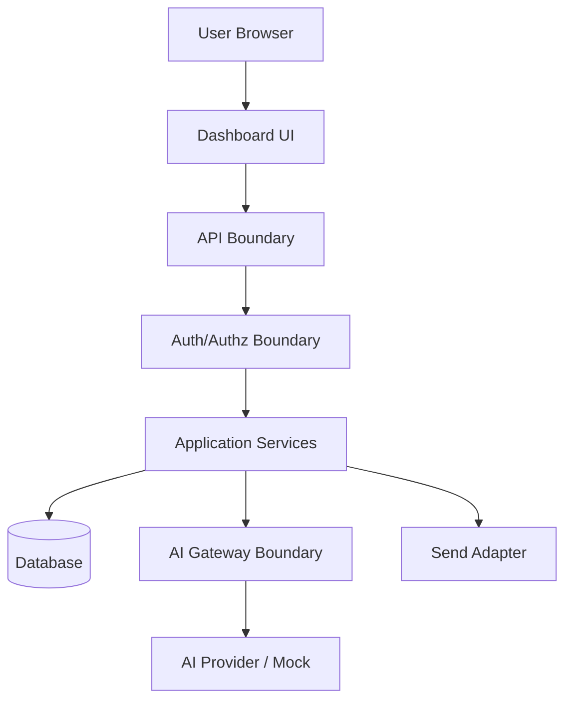

# 01 — Security Overview

> *"The MVP is small, but the data is real enough to require production-minded security."*

---

# Purpose

This document explains the security context and threat model for the MVP.

---

# Protected Assets

The MVP protects:

```text
user identity
workspace membership
role permissions
customer names
customer contact identifiers
customer notes summary
conversation messages
reply drafts
AI draft output
AI draft metadata
activity timeline
correlation IDs
```

---

# Trust Boundaries



---

# Primary Threats

```text
unauthenticated user accesses dashboard data
viewer performs agent action
user accesses another workspace conversation
AI sees unauthorized or excessive customer context
prompt injection influences AI output
AI reply sent without review
logs expose sensitive data
errors expose internals
demo seed uses real customer data
provider failure breaks manual workflow
```

---

# MVP Security Posture

Required posture:

```text
secure-by-default
human-in-control AI
tenant-scoped data access
least privilege
safe observability
privacy minimization
testable controls
```

---

# MVP Security Trade-Offs

## Accepted for MVP

```text
simple roles: owner, agent, viewer
simulated send adapter
mock AI provider support
basic activity events
manual retention policy notes
```

## Not Accepted

```text
frontend-only authorization
cross-workspace query shortcuts
AI auto-send
real secrets in repo
raw prompt logging by default
unsafe demo data
stack traces in UI
```

---

# Security Ownership

Security should be reviewed by:

```text
backend owner
frontend owner
AI feature owner
database/migration owner
product owner
security reviewer
```

---

# Security Rule

```text
Every high-risk action must have authentication, authorization, validation, logging, and tests.
```
