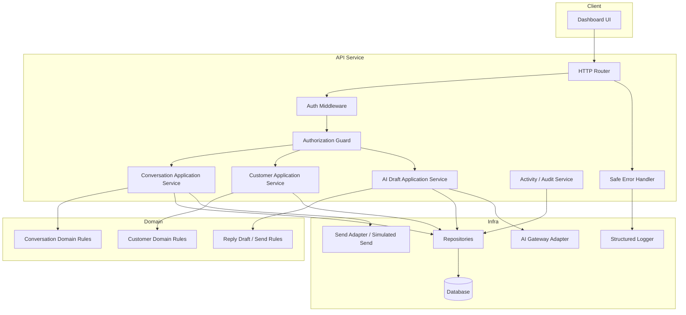

# 02 — System Architecture

> *"Architecture should make the safe path the easiest path."*

---

# Purpose

This document defines the MVP system architecture.

---

# System Architecture Diagram



---

# Architecture Decisions

## Decision 1 — API Owns Authorization

The API service must enforce all permissions.

Frontend checks may hide UI actions, but backend remains source of truth.

---

## Decision 2 — AI Gateway Boundary

The AI provider should be called only through an AI Gateway adapter.

Reason:

```text
central safety checks
mock provider support
cost/latency monitoring
fallback support
prompt/version control
```

---

## Decision 3 — Send Adapter Boundary

Reply sending should use a send adapter interface.

Reason:

```text
MVP can simulate send
future channels can be added
provider-specific logic stays isolated
```

---

## Decision 4 — Activity Logging as First-Class Component

Activity events should not be an afterthought.

Reason:

```text
debuggability
auditability
product operations analytics
AI quality review
support traceability
```

---

# Deployment Assumption

For MVP, assume:

```text
single API service
single dashboard app
single database
optional AI provider/mock
local/dev environment first
```

---

# Future Evolution

The architecture should allow future extraction:

```text
AI Gateway can become separate service
Integration Gateway can become separate service
workers can process ingestion/automation
analytics pipeline can be added later
```

---

# Architecture Rule

```text
Provider-specific logic must not leak into product domain or UI.
```
