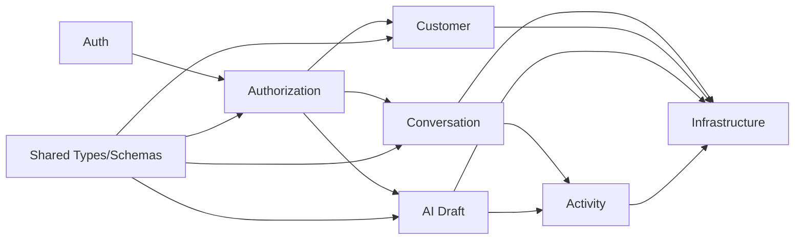

# 03 — Module Boundaries

> *"Module boundaries keep the MVP from becoming unmaintainable as soon as the second feature arrives."*

---

# Purpose

This document defines the MVP module boundaries.

---

# Module Map

```text
auth
authorization
conversation
customer
reply
ai-draft
activity
shared
infrastructure
```

---

# Auth Module

Responsible for:

```text
authenticated user identity
session/JWT parsing
current user context
```

Not responsible for:

```text
business role decisions
conversation access policy
```

---

# Authorization Module

Responsible for:

```text
workspace access
role permission checks
conversation access
action permission
```

Example checks:

```text
can_view_conversation
can_generate_ai_draft
can_send_reply
```

---

# Conversation Module

Responsible for:

```text
conversation list
conversation detail
message history
conversation status
reply send orchestration
```

Not responsible for:

```text
AI provider calls
customer profile rules
raw provider adapter logic
```

---

# Customer Module

Responsible for:

```text
customer profile retrieval
customer context summary
customer metadata
```

Not responsible for:

```text
conversation message rendering
AI generation
```

---

# AI Draft Module

Responsible for:

```text
AI draft request validation
conversation context building
prompt template selection
AI Gateway call
draft response normalization
AI draft event logging
```

Not responsible for:

```text
sending replies
updating customer profile
bypassing human review
```

---

# Activity Module

Responsible for:

```text
activity events
audit-like records
event timeline
AI draft event
reply sent/failed event
```

---

# Infrastructure Module

Responsible for:

```text
database access
AI provider client
send adapter
logging
config
time/id utilities
```

---

# Shared Module

Responsible for:

```text
types
schemas
error codes
permission constants
validation helpers
```

---

# Boundary Diagram



---

# Boundary Rules

```text
UI does not call database directly
UI does not call AI provider directly
conversation module does not own AI provider details
AI draft module does not send replies
authorization module is used by all action endpoints
infrastructure does not contain product decisions
```

---

# Anti-Patterns

Avoid:

```text
fat controllers
business logic inside UI component
AI call inside frontend
provider-specific payloads in domain layer
global query without workspace scope
activity log as optional side effect
```
