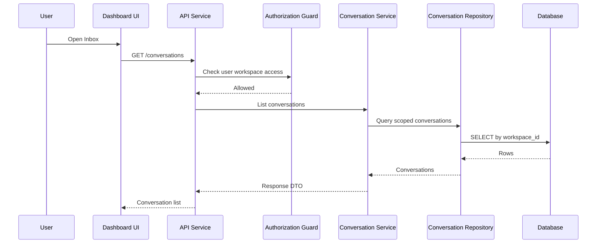
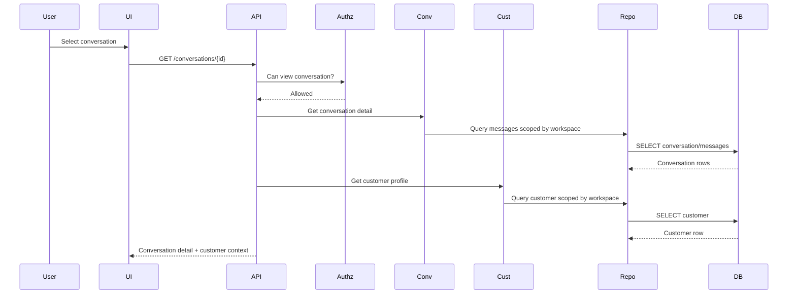
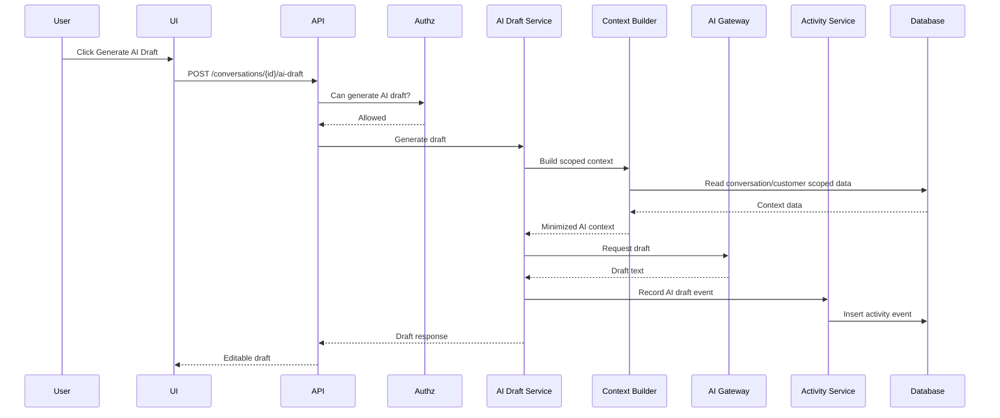
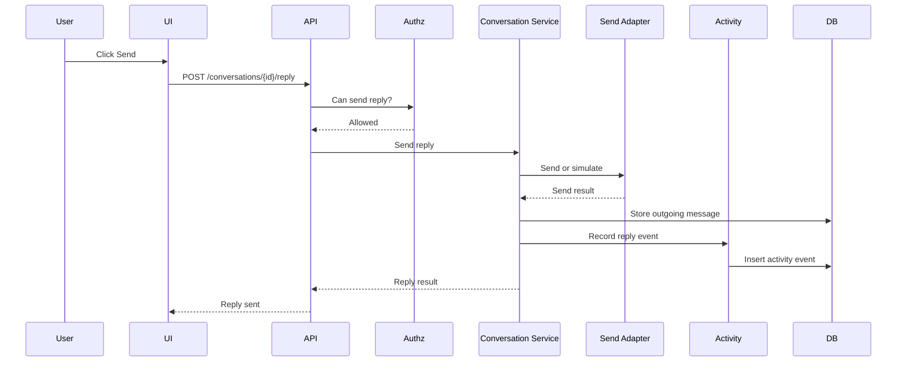
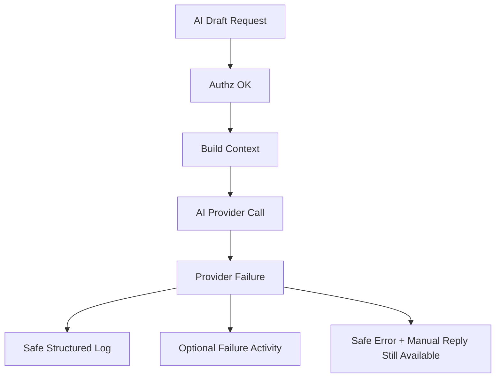

# 04 — Data Flow and Sequence

> *"Data flow should show exactly where authorization, AI safety, and activity logging happen."*

---

# Purpose

This document defines MVP data flow and sequence diagrams.

---

# Inbox Data Flow



---

# Conversation Detail Data Flow



---

# AI Draft Data Flow



---

# Reply Send Data Flow



---

# Failure Flow: AI Provider Fails



---

# Data Flow Rules

```text
authorization before data fetch
workspace scope in every query
AI context minimized before provider call
activity logging after high-value action
safe error returned on failure
draft remains human editable
```
