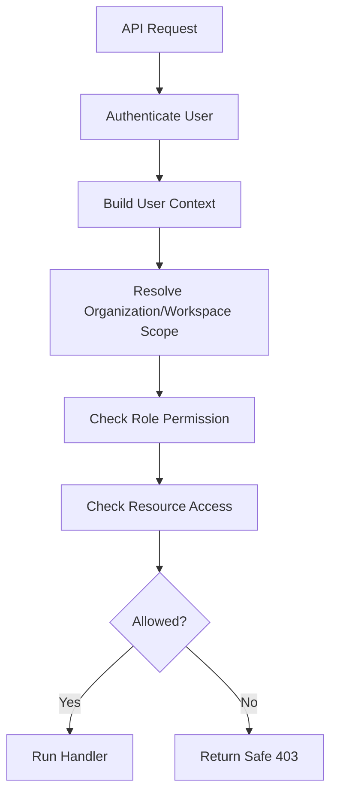

# 05 — Auth, Authz, and Tenant Scoping

> *"For CLARA MVP, access control is not a later enhancement. It is the foundation."*

---

# Purpose

This document defines authentication, authorization, and tenant scoping design.

---

# Authentication

MVP assumes an authenticated user identity is available through one of:

```text
session cookie
JWT
local dev mock auth
```

The exact implementation should be defined in the API Spec and implementation docs.

---

# User Context

Every authenticated request should resolve:

```text
user_id
organization_id
workspace_id
role
permissions
```

---

# Authorization Checks

Minimum action checks:

```text
can_view_inbox
can_view_conversation
can_view_customer_profile
can_generate_ai_draft
can_send_reply
can_view_activity
```

---

# Role Capability Matrix

| Action | Owner | Agent | Viewer |
|---|---:|---:|---:|
| View inbox | Yes | Yes | Yes |
| View conversation | Yes | Yes | Yes |
| View customer profile | Yes | Yes | Yes |
| Generate AI draft | Yes | Yes | No |
| Send reply | Yes | Yes | No |
| View activity | Yes | Yes | Yes |

---

# Tenant Scoping

Every query should include:

```text
organization_id
workspace_id
```

Example:

```text
WHERE organization_id = current_user.organization_id
AND workspace_id = current_user.workspace_id
```

Do not rely only on:

```text
conversation_id
customer_id
message_id
```

IDs alone are not sufficient.

---

# Authorization Flow



---

# Negative Cases

Must reject:

```text
unauthenticated request
viewer generating AI draft
viewer sending reply
user accessing another workspace conversation
user requesting another workspace customer profile
invalid conversation id
deleted/archived inaccessible resource
```

---

# Error Codes

Recommended:

```text
UNAUTHENTICATED
FORBIDDEN
NOT_FOUND
VALIDATION_ERROR
```

For cross-tenant resource access, prefer safe `NOT_FOUND` where appropriate to avoid resource enumeration.

---

# Audit Events

Consider recording:

```text
unauthorized high-risk attempt
AI draft generated
reply sent
reply failed
```

---

# Authz Rule

```text
If a resource is not scoped by workspace in the backend, it is a security bug.
```
