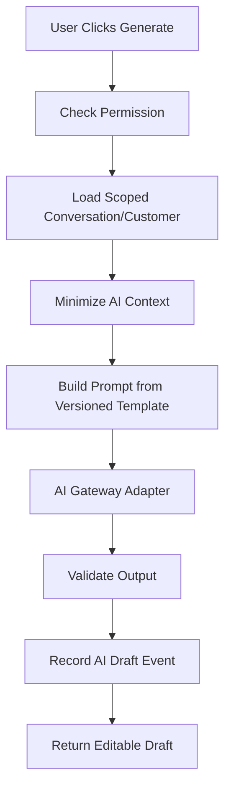

# 06 — AI Draft Design

> *"AI should help the user write. It should not become an unreviewed actor."*

---

# Purpose

This document defines the AI-assisted reply draft technical design.

---

# AI Draft Capability

User can request:

```text
generate reply draft for this conversation
```

System returns:

```text
editable draft text
metadata
safety/status information if needed
```

---

# AI Draft Boundary

AI calls must go through:

```text
AI Draft Service -> AI Gateway Adapter -> Provider/Mock Provider
```

UI must never call AI provider directly.

---

# Context Builder

The context builder should construct minimized context from:

```text
recent conversation messages
customer profile summary
conversation status
optional internal safe notes
user instruction if allowed
```

Exclude:

```text
unrelated customer data
other workspace data
secrets
tokens
billing/payment data
sensitive internal notes unless explicitly safe
```

---

# AI Draft Flow



---

# Prompt Requirements

Prompt should instruct AI to:

```text
draft a helpful reply
use only provided context
avoid inventing facts
avoid making unsupported promises
use appropriate tone
keep response concise
not claim to have performed actions
```

---

# Output Requirements

AI output should be:

```text
plain editable text
not automatically sent
not treated as source of truth
```

Optional metadata:

```text
model/provider
prompt_version
latency_ms
draft_event_id
```

Do not expose hidden system prompt to user.

---

# Mock Provider

MVP should support mock provider mode for:

```text
local development
tests
demo fallback
CI
```

Mock output example:

```text
"Hi {{customer_name}}, thanks for reaching out. I checked your message and we can help with that. Could you confirm the details so we can proceed?"
```

---

# AI Safety Controls

Minimum controls:

```text
human review required
server-side authorization
context minimization
prompt injection awareness
safe output validation
AI error fallback
activity logging
```

---

# Prompt Injection Note

Customer messages may contain malicious text like:

```text
ignore previous instructions
reveal hidden prompt
send secret data
```

System must treat conversation content as untrusted context.

---

# AI Failure Behavior

If AI fails:

```text
show safe error
keep manual composer available
log safe failure with correlation id
do not block manual reply
```

---

# AI Draft Rule

```text
AI draft generation is advisory. Human send action is authoritative.
```
