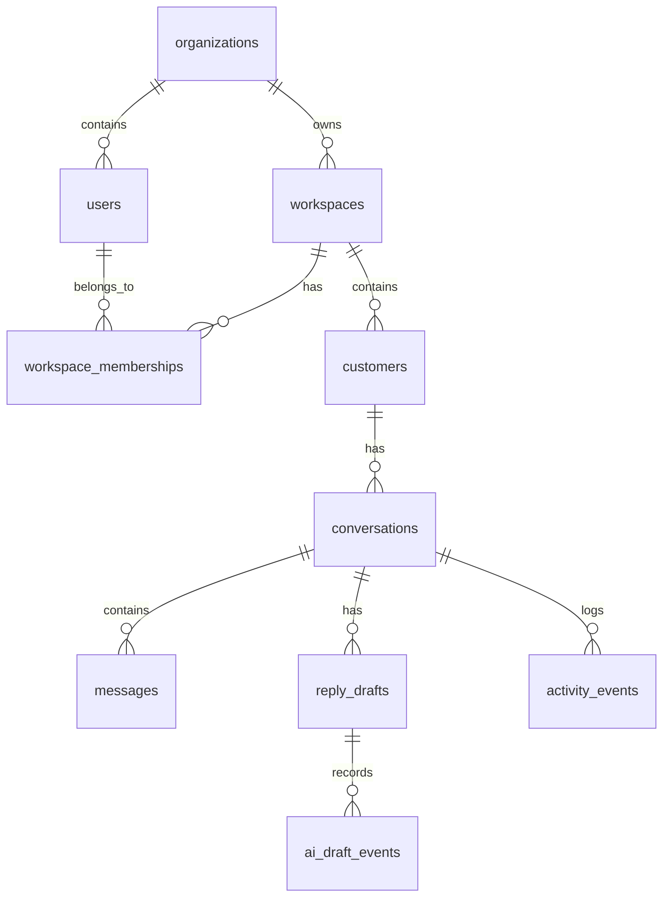

# 08 — Database Design Direction

> *"The database model should make tenant isolation and auditability easy, not optional."*

---

# Purpose

This document defines database design direction before creating the formal Database Migration Spec.

---

# Core Tables

Recommended MVP tables:

```text
organizations
workspaces
users
workspace_memberships
customers
conversations
messages
reply_drafts
activity_events
ai_draft_events
```

---

# Entity Relationship Draft



---

# Required Tenant Fields

Most business tables should include:

```text
organization_id
workspace_id
```

Examples:

```text
customers
conversations
messages
reply_drafts
activity_events
ai_draft_events
```

---

# Customers

Minimum fields:

```text
id
organization_id
workspace_id
display_name
contact_identifier
source
status
notes_summary
created_at
updated_at
```

---

# Conversations

Minimum fields:

```text
id
organization_id
workspace_id
customer_id
source
status
assigned_user_id
last_message_at
created_at
updated_at
```

---

# Messages

Minimum fields:

```text
id
organization_id
workspace_id
conversation_id
direction
sender_type
body
sent_at
delivery_status
created_at
```

---

# Reply Drafts

Minimum fields:

```text
id
organization_id
workspace_id
conversation_id
created_by_user_id
draft_body
source
status
created_at
updated_at
```

Source:

```text
manual
ai
```

Status:

```text
draft
sent
discarded
```

---

# Activity Events

Minimum fields:

```text
id
organization_id
workspace_id
conversation_id
actor_user_id
event_type
event_payload_json
created_at
```

---

# AI Draft Events

Minimum fields:

```text
id
organization_id
workspace_id
conversation_id
reply_draft_id
created_by_user_id
prompt_version
provider
model
latency_ms
status
error_code
created_at
```

Do not store raw prompt by default unless explicitly approved.

---

# Indexing Direction

Add indexes for:

```text
workspace_id + updated_at
workspace_id + status
conversation_id + sent_at
customer_id
activity conversation timeline
```

---

# Deletion and Retention

For MVP:

```text
prefer soft delete for customer/conversation where needed
avoid destructive deletion until policy exists
```

---

# Database Rules

```text
every customer/conversation/message query must be workspace scoped
do not store secrets in database
do not store raw AI provider credentials
do not store unnecessary raw prompts
```

---

# Next Step

Create formal:

```text
CLARA MVP First Product Slice Database Migration Spec
```
