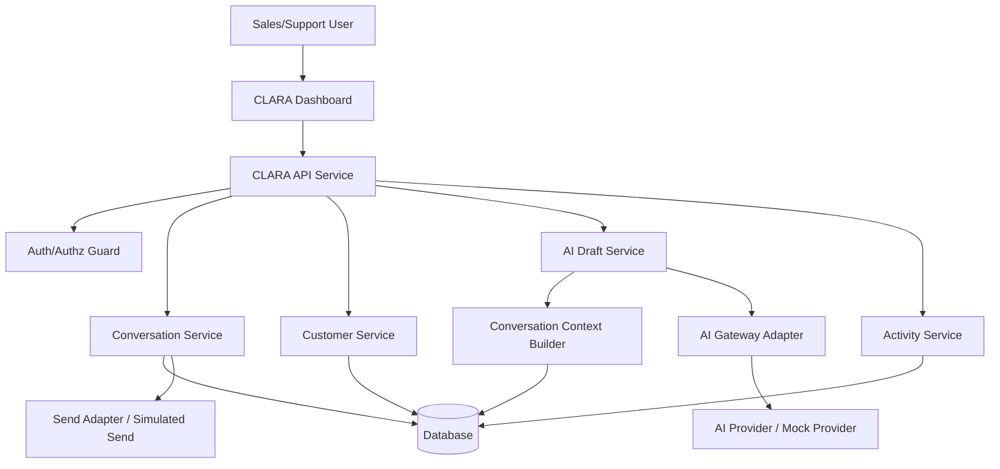

# CLARA MVP First Product Slice TDD

## Technical Design Document

---

# 1. Feature Name

```text
CLARA MVP — Unified Customer Conversation Inbox
```

---

# 2. Technical Summary

This MVP provides a secure, human-reviewed customer conversation workflow.

A user can:

```text
authenticate
view accessible conversations
open conversation detail
view customer profile context
generate an AI reply draft
edit the draft
send or simulate sending the final reply
record activity events
```

The system must enforce:

```text
server-side authorization
workspace/tenant scoping
AI context minimization
human review before send
safe logging
safe error handling
activity/audit tracking
```

---

# 3. Primary Technical Decision

CLARA MVP should be implemented as a thin vertical slice using these boundaries:

```text
Dashboard UI
API Service
Conversation Application Service
Customer Application Service
AI Draft Application Service
Activity/Audit Application Service
Data Repositories
AI Gateway Adapter
Send Adapter / Simulated Send Adapter
```

---

# 4. Architecture Style

Recommended architecture style:

```text
modular monolith first
clear internal boundaries
adapter pattern for AI and channel send
repository/data access layer
service-layer authorization guard
```

Why modular monolith first?

```text
faster MVP delivery
lower infrastructure complexity
easier testing
clear path to later service extraction
good fit for first product slice
```

Do not start with distributed microservices for MVP.

---

# 5. System Context



---

# 6. Key Flows

## 6.1 View Inbox

```text
User -> Dashboard -> API -> Authz Guard -> Conversation Service -> Repository -> Response
```

## 6.2 Open Conversation Detail

```text
User -> Dashboard -> API -> Authz Guard -> Conversation Service -> Customer Service -> Repository -> Response
```

## 6.3 Generate AI Draft

```text
User -> Dashboard -> API -> Authz Guard -> AI Draft Service -> Context Builder -> AI Gateway -> Draft -> Activity Log -> Response
```

## 6.4 Send Reply

```text
User -> Dashboard -> API -> Authz Guard -> Conversation Service -> Send Adapter -> Message Record -> Activity Log -> Response
```

---

# 7. Core Entities

MVP should model:

```text
Organization
Workspace
User
Role
Customer
Conversation
Message
ReplyDraft
ActivityEvent
AIDraftEvent
```

---

# 8. Authorization Model

Every request must enforce:

```text
authenticated user
workspace access
role permission
conversation access
action permission
```

Frontend role checks are for UX only.

Backend remains source of truth.

---

# 9. AI Draft Model

AI draft generation must:

```text
use minimal needed context
exclude unauthorized data
exclude secrets
label output as draft
require human review
record AI draft activity
support mock provider for local/dev
support safe failure
```

AI must not:

```text
send automatically
perform irreversible action
expose hidden prompt
access cross-workspace data
```

---

# 10. Send Model

For MVP, sending may use:

```text
simulated send adapter
```

or a single channel adapter if already available.

The design should support future adapters:

```text
WhatsApp adapter
Instagram adapter
TikTok adapter
Email adapter
Web chat adapter
```

Do not couple UI directly to provider-specific send implementation.

---

# 11. Observability

Minimum observability:

```text
correlation_id per request
structured logs
AI draft latency metric
AI draft failure metric
send success/failure metric
authorization failure event
safe error logs
```

Never log:

```text
tokens
cookies
API keys
raw secrets
unnecessary raw customer messages
full prompt with sensitive content
```

---

# 12. Error Handling

Errors should follow a safe standard shape:

```json
{
  "error": {
    "code": "FORBIDDEN",
    "message": "You do not have permission to perform this action.",
    "correlation_id": "example-correlation-id"
  }
}
```

Do not expose:

```text
stack traces
SQL errors
provider raw errors
secrets
internal file paths
```

---

# 13. Technical Risks

| Risk | Impact | Mitigation |
|---|---|---|
| AI hallucination | Bad customer reply | Human review, editable draft |
| Cross-tenant access | Privacy/security breach | Workspace scoping, tests |
| Provider failure | Draft unavailable | Mock/fallback/manual reply |
| Scope creep | MVP delay | P0/P1/P2 enforcement |
| Send adapter complexity | Delivery delay | Simulated send first |
| Sensitive logging | Privacy breach | Redaction and log policy |

---

# 14. Implementation Approach

Recommended sequence:

```text
1. Repository skeleton
2. API bootstrap
3. Auth/authz placeholder and workspace scope
4. Data model and seed data
5. Conversation inbox API
6. Conversation detail API
7. Customer profile API
8. AI draft API with mock provider
9. Reply send/simulated send API
10. Activity log
11. Dashboard UI
12. Integration tests
13. Security tests
14. Demo script
```

---

# 15. Acceptance Criteria

TDD is accepted when it clearly defines:

```text
architecture boundaries
module responsibilities
data flow
auth/authz model
AI draft safety model
API direction
database direction
observability strategy
error strategy
testing strategy
implementation sequence
```

---

# 16. Next Required Documents

```text
UX Flow + UI Spec
API Spec
Database Migration Spec
Security & Privacy Checklist
Test Plan
Backlog / Task Breakdown
README / Runbook
Demo Script
```
