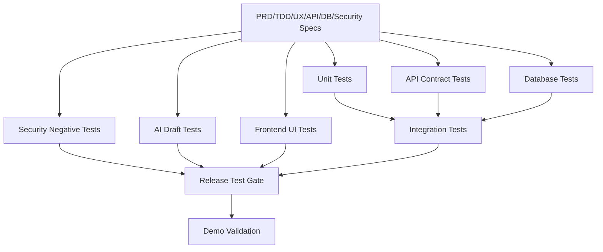

# CLARA MVP First Product Slice Test Plan

## Unified Customer Conversation Inbox Test Plan

---

# 1. Test Plan Summary

This Test Plan validates the MVP workflow:

```text
authenticated user opens inbox
user opens conversation
user sees customer profile
agent/owner generates AI draft
user edits draft
user manually sends reply
activity timeline updates
security boundaries hold
```

---

# 2. Quality Goals

The MVP should be:

```text
functionally correct
secure by default
tenant-isolated
AI-safe
privacy-conscious
observable
recoverable from AI/send failures
demo-ready
```

---

# 3. Test Scope

## In Scope

```text
authentication checks
authorization checks
workspace scoping
conversation inbox API
conversation detail API
customer profile API
AI draft API
reply send/simulated send API
activity API
database migrations
demo seed data
frontend main workspace
AI draft UX states
manual reply path
safe errors
safe logging expectations
```

## Out of Scope

```text
full omnichannel provider testing
real production provider delivery guarantees
mobile app testing
advanced analytics testing
billing testing
enterprise SSO testing
multi-region performance testing
```

---

# 4. Test Layers

```text
unit tests
integration tests
API contract tests
database tests
security negative tests
AI mock/failure tests
frontend UI tests
manual QA
demo validation
```

---

# 5. Required Test Personas

```text
Owner
Agent
Viewer
Unauthenticated User
Cross-Workspace User
```

---

# 6. Required Test Data

```text
Demo Organization
Demo Sales Workspace
Owner Demo User
Agent Demo User
Viewer Demo User
Customer Budi
Customer Sari
Conversation Budi Stock
Conversation Sari Follow-up
Messages
AI Draft
Activity Events
Cross-workspace fixture
```

---

# 7. Critical Go/No-Go Tests

MVP cannot pass if any of these fail:

```text
unauthenticated user blocked
viewer cannot generate AI draft
viewer cannot send reply
cross-workspace conversation access blocked
AI draft endpoint does not send reply
manual reply works when AI fails
reply body validation works
activity event recorded for AI draft and reply send
logs/errors do not expose secrets
```

---

# 8. Test Flow Overview



---

# 9. Definition of Done

The MVP test plan is complete when:

```text
test cases map to PRD/TDD/API/DB/security requirements
negative security tests are explicit
AI failure tests are explicit
manual QA checklist exists
release test gate exists
backlog can derive testing tasks from this document
```
