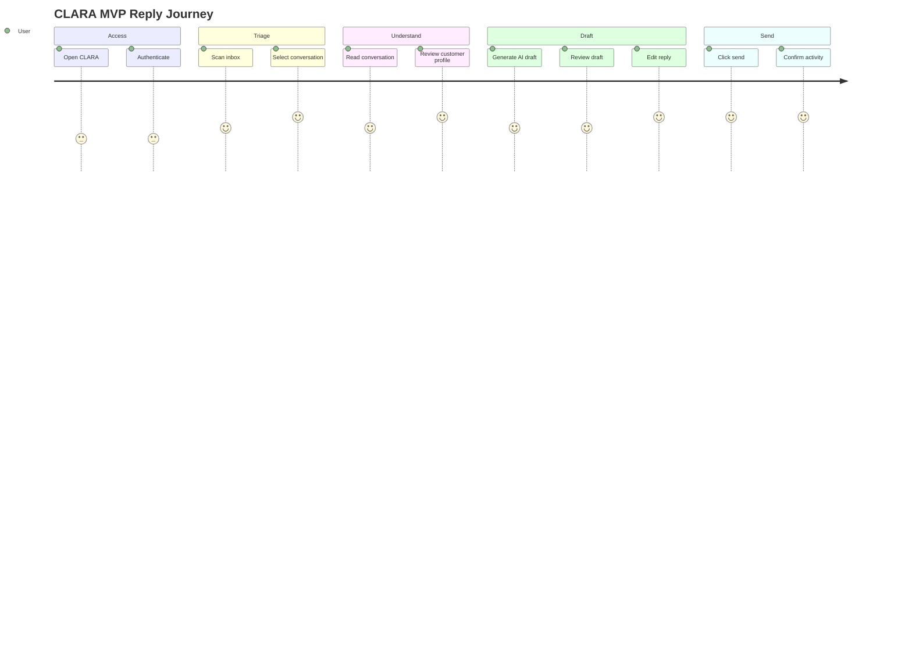

# 02 — User Journey Map

> *"Journey maps keep the team focused on real user progress instead of screen count."*

---

# Primary Persona

```text
Sales/support operator
```

Goal:

```text
reply to customer quickly with enough context and without making unsafe AI mistakes
```

---

# Journey: Reply with AI Assistance

| Step | User Goal | UI Surface | System Response | Risk |
|---:|---|---|---|---|
| 1 | Access CLARA | Auth Gate | Authenticate or redirect | auth confusion |
| 2 | See work queue | Inbox | Show conversations | empty/confusing list |
| 3 | Choose customer issue | Inbox Row | Select conversation | wrong conversation |
| 4 | Understand issue | Thread | Show messages | slow load |
| 5 | Understand customer | Sidebar | Show profile/activity | missing context |
| 6 | Get help replying | Composer | Generate AI draft | hallucination |
| 7 | Review and adjust | Composer | Editable draft | over-trust AI |
| 8 | Send final reply | Composer | Send/simulate send | accidental send |
| 9 | Confirm result | Thread/Activity | Show sent message/activity | unclear status |

---

# Journey Diagram



---

# Secondary Journey: Manual Reply Without AI

```text
1. User opens conversation.
2. User reads message.
3. User writes reply manually.
4. User sends reply.
5. System records activity.
```

This must work even if AI fails.

---

# Negative Journey: Viewer Tries to Send

```text
1. Viewer opens conversation.
2. Viewer can read conversation.
3. AI draft button is hidden or disabled.
4. Composer is read-only or unavailable.
5. If viewer attempts direct API action, backend blocks it.
```

---

# Negative Journey: AI Draft Fails

```text
1. User clicks Generate AI Draft.
2. Draft generation fails.
3. UI shows safe error.
4. Composer remains usable.
5. User writes manually.
```

---

# UX Success Definition

The journey is successful when:

```text
user can complete reply without leaving workspace
AI saves time but does not remove user control
profile context is visible at the moment of writing
status after send is obvious
```
